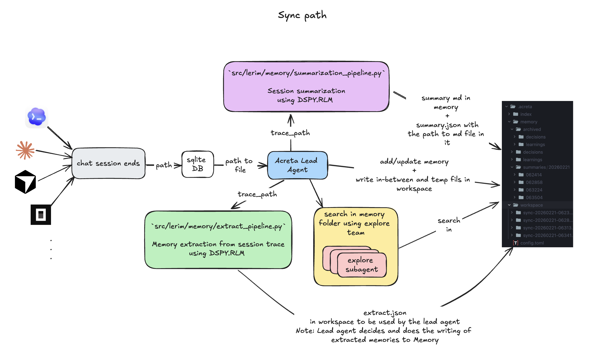
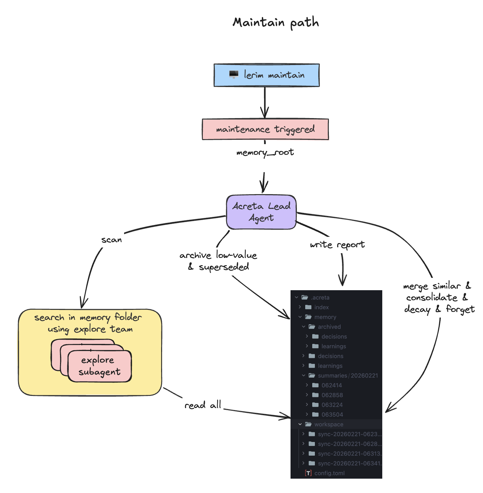
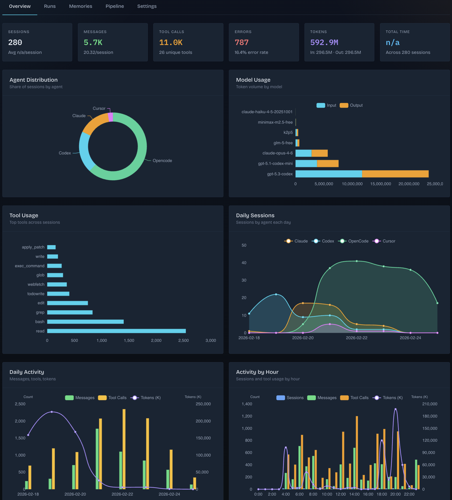

<p align="center">
  
</p>

<p align="center"><strong>Continual learning layer for coding agents</strong></p>
<p align="center"><a href="https://lerim.dev/">lerim.dev</a> · <a href="https://docs.lerim.dev/">docs</a> · <a href="https://pypi.org/project/lerim/">pypi</a></p>

<p align="center">
  
</p>

Lerim is a continual learning layer that gives coding agents persistent memory across sessions. It watches your agent conversations (Claude Code, Codex, Cursor, OpenCode, ...), extracts decisions and learnings, and stores them as plain markdown files that both humans and agents can read. Memories are refined offline over time through merging, deduplication, archiving, and decay-based forgetting. You can query stored memories anytime to bring relevant past context into your current session.

## Summary

Lerim is file-first and primitive-first.

- Primitive folders: `decisions`, `learnings`, `summaries`
- Project memory first: `<repo>/.lerim/`
- Global fallback memory: `~/.lerim/`
- Search default: `files` (no index required)
- Orchestration runtime: `pydantic-ai` lead agent + read-only explorer subagent
- Extraction/summarization: `dspy.RLM` role-configured models (default OpenRouter `x-ai/grok-4.1-fast`)
- Graph source of truth: explicit id/slug references (and `related` when present)

This keeps memory readable by humans and easy for agents to traverse.

Lead flow:

1. Extract candidates from transcript archive.
2. Lead agent orchestrates with runtime tools and delegates a read-only explorer subagent.
3. Lead runs deterministic decision policy for `add|update|no-op`.
4. Lead writes memory only through boundary-enforced runtime write/edit tools.
5. `sync` stays lightweight; `maintain` runs offline memory refinement (merge duplicates, archive low-value entries, consolidate related memories, apply time-based decay).

### Sync path

<p align="center">
  
</p>

The sync path processes new agent sessions: reads transcript archives, extracts decision and learning candidates via DSPy, deduplicates against existing memories, and writes new primitives to the memory folder.

### Maintain path

<p align="center">
  
</p>

The maintain path runs offline refinement over stored memories: merges duplicates, archives low-value entries, consolidates related memories, and applies time-based decay to keep the memory store clean and relevant.

## Quick start

### 1. Install

```bash
pip install lerim
```

Prerequisites: Python 3.10+, [Docker](https://docs.docker.com/get-docker/)

### 2. Set up

```bash
lerim init                     # interactive setup — detects your coding agents
lerim project add .            # add current project (repeat for other repos)
```

### 3. Start Lerim

```bash
lerim up
```

That's it. Lerim is now running as a Docker service — syncing sessions, extracting
decisions and learnings, refining memories, and serving a dashboard at `http://localhost:8765`.

### 4. Teach your agent about Lerim

Install the Lerim skill so your agent knows how to query past context:

```bash
npx skills add lerim-dev/lerim-cli
```

This works with Claude Code, Codex, Cursor, Copilot, Cline, Windsurf, OpenCode, and [other agents that support skills](https://skills-ai.dev).

### 5. Get the most out of Lerim

At the start of a session, tell your agent:

> Check lerim for any relevant memories about [topic you're working on].

Your agent will run `lerim ask` or `lerim memory search` to pull in past decisions and learnings before it starts working.

### Running without Docker

If you prefer not to use Docker, Lerim works directly:

```bash
brew install deno              # required for extraction
lerim connect auto             # detect agent platforms
lerim daemon                   # run sync + maintain in terminal
```

## Dashboard

The dashboard gives you a local UI for session analytics, memory browsing, and runtime status.

<p align="center">
  
</p>

### Run it locally

```bash
# simple
lerim dashboard

# explicit host/port
python -m lerim dashboard --host 127.0.0.1 --port 8765
```

Then open `http://127.0.0.1:8765`.

### Tabs

- **Overview**: high-level metrics and charts (sessions, messages, tools, errors, tokens, activity by day/hour, model usage).
- **Runs**: searchable session list (50/page) with status and metadata; open any run in a full-screen chat viewer.
- **Memories**: library + editor for memory records (filter, inspect, edit title/body/kind/confidence/tags).
- **Pipeline**: sync/maintain status, extraction queue state, and latest extraction report.
- **Settings**: dashboard-editable config for server, model roles, and tracing; saves to `~/.lerim/config.toml`.

### Notes

- Top bar filters (`Agent`, `Scope`) update dashboard metrics and run listings.
- Graph Explorer code is kept in the project but currently hidden in the UI.

## CLI reference

Full command reference: [`skills/lerim/cli-reference.md`](skills/lerim/cli-reference.md)

```bash
# Setup (host-only)
lerim init                                  # interactive setup wizard
lerim project add ~/codes/my-app            # register a project
lerim project list                          # list registered projects

# Docker service
lerim up                                    # start Lerim container
lerim down                                  # stop it
lerim logs --follow                         # tail logs

# Alternative: run directly without Docker
lerim serve                                 # start HTTP server + daemon loop

# Service commands (require lerim up or lerim serve running)
lerim ask "Why did we choose this?"          # query memories
lerim sync                                  # one-shot: sync sessions + extract
lerim maintain                              # one-shot: merge, archive, decay
lerim status                                # runtime state
lerim dashboard                             # show dashboard URL

# Local commands (run on host, no server needed)
lerim memory search "auth pattern"          # keyword search
lerim memory list                           # list all memories
lerim memory add --title "..." --body "..." # manual memory
lerim connect auto                          # detect and connect platforms
```

### Development

```bash
uv venv && source .venv/bin/activate
uv pip install -e .
lerim init                    # first-time config
lerim project add .           # track this repo
docker build -t lerim .       # build Docker image locally
lerim up                      # start the service
tests/run_tests.sh unit
tests/run_tests.sh all
```

### Configuration

TOML-layered config (low to high priority):

1. `src/lerim/config/default.toml` (shipped with package -- all defaults)
2. `~/.lerim/config.toml` (user global)
3. `<repo>/.lerim/config.toml` (project overrides)
4. `LERIM_CONFIG` env var path (explicit override, for CI/tests)

API keys come from environment variables only (`ZAI_API_KEY`, `OPENROUTER_API_KEY`, `OPENAI_API_KEY`, optional `ANTHROPIC_API_KEY`).

Default role model config (from `src/lerim/config/default.toml`):

- `lead`: `provider=openrouter`, `model=x-ai/grok-4.1-fast`
- `explorer`: `provider=openrouter`, `model=x-ai/grok-4.1-fast`
- `extract`: `provider=openrouter`, `model=x-ai/grok-4.1-fast`, `sub_model=x-ai/grok-4.1-fast`
- `summarize`: `provider=openrouter`, `model=x-ai/grok-4.1-fast`, `sub_model=x-ai/grok-4.1-fast`

### Tracing (OpenTelemetry)

Lerim uses PydanticAI's built-in OpenTelemetry instrumentation for agent observability.
Stderr logs are kept minimal; detailed traces (model calls, tool calls, tokens, timing)
go through OTel spans instead.

One-time setup:

```bash
uv pip install logfire
logfire auth
logfire projects new
```

Enable tracing:

```bash
# env var (quick toggle)
LERIM_TRACING=1 lerim sync

# or in config
# .lerim/config.toml
[tracing]
enabled = true
```

View traces at https://logfire.pydantic.dev.

Config options (`[tracing]` in TOML):

| Key | Default | Description |
|-----|---------|-------------|
| `enabled` | `false` | Enable tracing (or set `LERIM_TRACING=1`) |
| `include_httpx` | `false` | Capture raw HTTP request/response bodies |
| `include_content` | `true` | Include prompt/completion text in spans |

### Connecting coding agents

Lerim ingests session transcripts from your coding agents to extract decisions and learnings. The `lerim connect` command registers an agent platform so Lerim knows where to find its sessions.

#### Supported agents

| Platform | Session store | Format |
|----------|--------------|--------|
| `claude` | `~/.claude/projects/` | JSONL files |
| `codex` | `~/.codex/sessions/` | JSONL files |
| `cursor` | `~/Library/Application Support/Cursor/User/globalStorage/` (macOS) | SQLite `state.vscdb`, exported to JSONL cache |
| `opencode` | `~/.local/share/opencode/` | SQLite `opencode.db`, exported to JSONL cache |

#### How to connect

Auto-detect and connect all supported platforms at once:

```bash
lerim connect auto
```

Or connect a specific platform:

```bash
lerim connect claude
lerim connect codex
lerim connect cursor
lerim connect opencode
```

List currently connected platforms:

```bash
lerim connect list
```

Disconnect a platform:

```bash
lerim connect remove claude
```

#### Custom session path

If your agent stores sessions in a non-default location, use `--path` to point Lerim to the correct folder:

```bash
lerim connect claude --path /custom/path/to/claude/sessions
lerim connect cursor --path ~/my-cursor-data/globalStorage
```

The path is expanded (`~` is resolved) and must exist on disk. This overrides the auto-detected default for that platform.

### Search

Retrieval is file-first: scan markdown memory files directly. No index required.

## Memory layout

Project scope:

```text
<repo>/.lerim/
  config.toml              # project overrides
  memory/
    decisions/
    learnings/
    summaries/
      YYYYMMDD/
        HHMMSS/
          {slug}.md
    archived/
      decisions/
      learnings/
  meta/
    traces/
      sessions/
  workspace/
    sync-<YYYYMMDD-HHMMSS>-<shortid>/
      extract.json
      summary.json
      memory_actions.json
      agent.log
      subagents.log
      session.log
    maintain-<YYYYMMDD-HHMMSS>-<shortid>/
      maintain_actions.json
      agent.log
      subagents.log
  index/   # reserved
```

Global fallback scope follows the same layout under `~/.lerim/`.

## Primitive frontmatter (lean)

- `decision`: `id,title,created,updated,source,confidence,tags`
- `learning`: `id,title,created,updated,source,confidence,tags,kind`
- `summary`: `id,title,description,date,time,coding_agent,raw_trace_path,run_id,repo_name,created,source,tags`

All metadata lives in frontmatter — no sidecars.

## Reset policy

Memory reset is explicit and destructive.

- `lerim memory reset --scope project|global|both --yes`
- Deletes `memory/`, `workspace/`, and `index/` under selected root(s), then recreates canonical folders.
- `--scope project`: resets `<repo>/.lerim/` only.
- `--scope global`: resets `~/.lerim/` only (includes sessions DB).
- `--scope both` (default): resets both.
- Sessions DB lives in global `index/`, so `--scope project` alone does not reset sessions.

Fresh start:
```bash
lerim memory reset --yes        # wipe everything
lerim sync --max-sessions 5     # re-sync newest conversations
```

## Docs

Full documentation: [docs.lerim.dev](https://docs.lerim.dev)

- [Getting Started](https://docs.lerim.dev/getting-started/)
- [CLI Reference](https://docs.lerim.dev/cli-reference/)
- [Configuration](https://docs.lerim.dev/configuration/)
- [Architecture](https://docs.lerim.dev/architecture/)
- [Contributing](https://docs.lerim.dev/contributing/)
