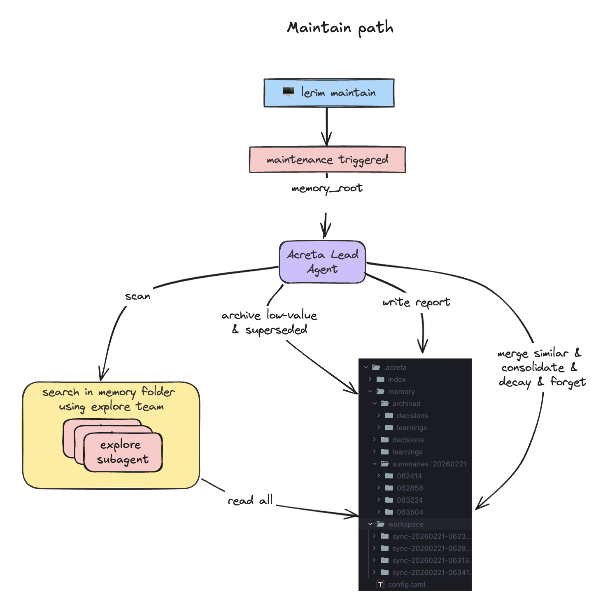
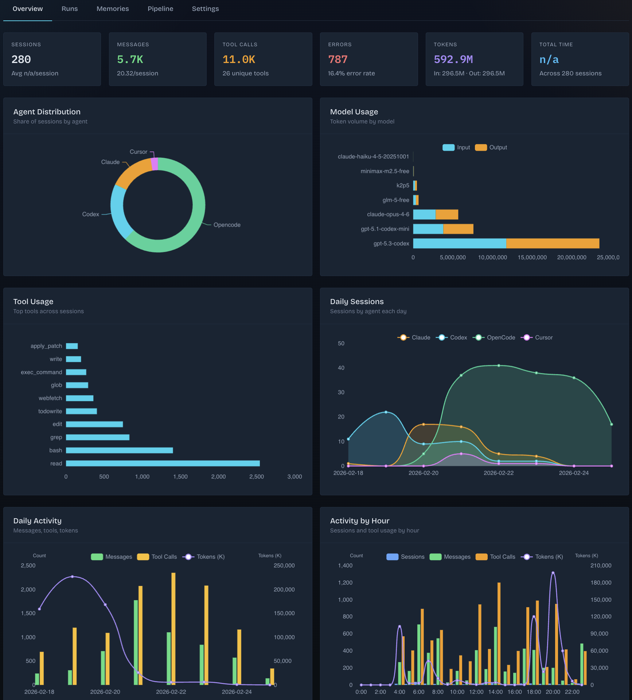

<p align="center">
  
</p>

<h3 align="center">The context graph layer for coding agents.<br>Lerim extracts the decisions, the reasoning, and the <em>why</em> -- so no agent starts blind.</h3>

<p align="center">
  <a href="https://pypi.org/project/lerim/"></a>
  <a href="https://pypi.org/project/lerim/"></a>
  <a href="https://github.com/lerim-dev/lerim-cli/blob/main/LICENSE"></a>
  <a href="https://github.com/lerim-dev/lerim-cli/actions"></a>
  <a href="https://github.com/lerim-dev/lerim-cli"></a>
</p>

<p align="center"><a href="https://lerim.dev/">lerim.dev</a> · <a href="https://docs.lerim.dev/">docs</a> · <a href="https://pypi.org/project/lerim/">pypi</a></p>

## The Problem

> AI agents decide fast -- but the reasoning is lost after every session. Every decision, every "we tried X and it didn't work," every architectural choice -- gone.

> And if you use multiple agents -- Claude Code at the terminal, Cursor in the IDE, Codex for reviews -- none of them know what the others learned. The *why* behind your project is **scattered across isolated sessions, lost between agents**.

> Everyone stores memory. Nobody extracts the reasoning.

## The Solution

Lerim is the **context graph layer** for coding agents -- it watches sessions, extracts the reasoning behind decisions, and builds a shared context graph across agents, projects, and teams.

- **Watches** your agent sessions across all supported coding agents
- **Extracts** the reasoning behind decisions -- the *why*, not just the *what* -- using LLM pipelines (DSPy + OpenAI Agents SDK)
- **Stores** everything as plain markdown files in your repo (`.lerim/`)
- **Refines** knowledge continuously -- merges duplicates, archives stale entries, applies time-based decay
- **Connects** learnings into a context graph -- related decisions and patterns are linked
- **Remembers** across sessions -- hot-memory and cross-session intelligence keep agents informed
- **Unifies** knowledge across all your agents -- what one agent learns, every other can recall
- **Answers** questions about past context: `lerim ask "why did we choose Postgres?"`

No proprietary format. No database lock-in. Just markdown files that both humans and agents can read. Knowledge compounds over time, not stale.

## Supported Agents

Lerim works with any coding agent that produces session traces. Current adapters:

| Agent | Session Format | Status |
|-------|---------------|--------|
| Claude Code | JSONL traces | Supported |
| Codex CLI | JSONL traces | Supported |
| Cursor | SQLite to JSONL | Supported |
| OpenCode | SQLite to JSONL | Supported |

*Adding a new agent adapter is straightforward -- PRs welcome! See `src/lerim/adapters/` for examples.*

## How It Works

Lerim is file-first and primitive-first.

- Primitive folders: `decisions`, `learnings`, `summaries`
- Project memory: `<repo>/.lerim/`
- Global fallback: `~/.lerim/`
- Search: file-based (no index required)
- Orchestration: `openai-agents` lead agent + Codex filesystem sub-agent
- Multi-provider: ResponsesProxy adapter enables Codex sub-agent across any LLM provider
- Extraction/summarization: `dspy.ChainOfThought` with transcript windowing

### Sync path

<p align="center">
  
</p>

The sync path processes new agent sessions: reads transcript archives, extracts decision and learning candidates via DSPy, deduplicates against existing knowledge, and writes new entries to the project's knowledge store.

### Maintain path

<p align="center">
  
</p>

The maintain path runs offline refinement over stored knowledge: merges duplicates, archives low-value entries, consolidates related learnings, and applies time-based decay to keep the context graph clean and relevant.

## Quick start

### 1. Install

```bash
pip install lerim
```

Prerequisites: Python 3.10+, [Docker](https://docs.docker.com/get-docker/) (optional)

### 2. Set up

```bash
lerim init                     # interactive setup — detects your coding agents
lerim project add .            # add current project (repeat for other repos)
```

### 3. Set API keys

Set keys for the providers you configure (defaults: MiniMax primary, Z.AI fallback):

```bash
export MINIMAX_API_KEY="..."   # if using MiniMax (default)
export ZAI_API_KEY="..."       # if using Z.AI (default fallback)
```

You only need keys for providers referenced in your `[roles.*]` config. See [model roles](https://docs.lerim.dev/configuration/model-roles/).

### 4. Start Lerim

```bash
lerim up
```

That's it. Lerim is now running as a Docker service — syncing sessions, extracting
decisions and learnings, refining memories, and serving a dashboard at `http://localhost:8765`.

### 5. Teach your agent about Lerim

Install the Lerim skill so your agent knows how to query past context:

```bash
lerim skill install
```

This copies skill files (SKILL.md, cli-reference.md) into your agent's skill directory.

### 6. Get the most out of Lerim

At the start of a session, tell your agent:

> Check lerim for any relevant memories about [topic you're working on].

Your agent will run `lerim ask` or `lerim memory search` to pull in past decisions and learnings before it starts working.

### Running without Docker

If you prefer not to use Docker, Lerim works directly:

```bash
lerim connect auto             # detect agent platforms
lerim serve                    # run HTTP server + daemon loop
```

### Local models (Ollama)

Lerim works with local models via [Ollama](https://ollama.com). Set `provider = "ollama"` in your role config and Lerim will automatically load models into GPU/RAM before each sync/maintain cycle and unload them after to free memory (`auto_unload = true` in `[providers]`).

```bash
ollama serve                   # start Ollama (runs outside Docker)
```

For Docker deployments, set `ollama = "http://host.docker.internal:11434"` in `[providers]` so the container can reach the host Ollama instance. See [model roles](https://docs.lerim.dev/configuration/model-roles/) for full configuration.

## Dashboard

The dashboard gives you a local UI for session analytics, knowledge browsing, and runtime status.

<p align="center">
  
</p>

### Tabs

- **Overview**: high-level metrics and charts (sessions, messages, tools, errors, tokens, activity by day/hour, model usage).
- **Runs**: searchable session list with status and metadata; open any run in a full-screen chat viewer.
- **Memories**: library + editor for memory records (filter, inspect, edit title/body/kind/confidence/tags).
- **Pipeline**: sync/maintain status, extraction queue state, and latest extraction report.
- **Settings**: dashboard-editable config for server, model roles, and tracing; saves to `~/.lerim/config.toml`.

## CLI reference

Full command reference: [`skills/lerim/cli-reference.md`](skills/lerim/cli-reference.md)

```bash
# Setup (host-only)
lerim init                                  # interactive setup wizard
lerim project add ~/codes/my-app            # register a project
lerim project list                          # list registered projects

# Docker service
lerim up                                    # start Lerim container
lerim down                                  # stop it
lerim logs --follow                         # tail logs

# Alternative: run directly without Docker
lerim serve                                 # start HTTP server + daemon loop

# Service commands (require lerim up or lerim serve running)
lerim ask "Why did we choose this?"          # query memories
lerim sync                                  # one-shot: sync sessions + extract
lerim maintain                              # one-shot: merge, archive, decay
lerim status                                # runtime state

# Local commands (run on host, no server needed)
lerim memory search "auth pattern"          # keyword search
lerim memory list                           # list all memories
lerim memory add --title "..." --body "..." # manual memory
lerim connect auto                          # detect and connect platforms
lerim skill install                         # install skill into agent directories
```

### Configuration

TOML-layered config (low to high priority):

1. `src/lerim/config/default.toml` (shipped with package -- all defaults)
2. `~/.lerim/config.toml` (user global)
3. `<repo>/.lerim/config.toml` (project overrides)
4. `LERIM_CONFIG` env var path (explicit override, for CI/tests)

API keys come from environment variables only. Set keys for the providers you use:

| Variable | Provider | Default role |
|----------|----------|-------------|
| `MINIMAX_API_KEY` | MiniMax | Primary (all roles) |
| `ZAI_API_KEY` | Z.AI | Fallback |
| `OPENROUTER_API_KEY` | OpenRouter | Optional alternative |
| `OPENAI_API_KEY` | OpenAI | Optional alternative |
| `ANTHROPIC_API_KEY` | Anthropic | Optional alternative |

Default model config (from `src/lerim/config/default.toml`):

- All roles: `provider=minimax`, `model=MiniMax-M2.5`
- Fallback: `zai:glm-4.7` (lead/codex), `zai:glm-4.5-air` (extract/summarize)

### Development

```bash
uv venv && source .venv/bin/activate
uv pip install -e '.[test]'
lerim init                    # first-time config
lerim project add .           # track this repo
lerim up                      # start the service
tests/run_tests.sh unit
tests/run_tests.sh all
```

### Tracing (OpenTelemetry)

Lerim uses OpenTelemetry for agent observability, with traces routed through the OpenAI Agents SDK tracing layer.

```bash
# Enable tracing
LERIM_TRACING=1 lerim sync

# or in config
# .lerim/config.toml
[tracing]
enabled = true
```

## Memory layout

Project scope:

```text
<repo>/.lerim/
  config.toml              # project overrides
  memory/
    decisions/
    learnings/
    summaries/
      YYYYMMDD/
        HHMMSS/
          {slug}.md
    archived/
      decisions/
      learnings/
  workspace/
    sync-<YYYYMMDD-HHMMSS>-<shortid>/
    maintain-<YYYYMMDD-HHMMSS>-<shortid>/
  index/   # reserved
```

Global fallback scope follows the same layout under `~/.lerim/`.

## Contributing

Lerim is open to contributions. Whether it's a new agent adapter, a bug fix, or a documentation improvement, PRs are welcome.

- Read the [Contributing Guide](https://docs.lerim.dev/contributing/getting-started/)
- Browse [open issues](https://github.com/lerim-dev/lerim-cli/issues)
- Agent adapter PRs are especially appreciated -- see `src/lerim/adapters/` for examples

## Docs

Full documentation: [docs.lerim.dev](https://docs.lerim.dev)

- [Quickstart](https://docs.lerim.dev/quickstart/)
- [Installation](https://docs.lerim.dev/installation/)
- [CLI Reference](https://docs.lerim.dev/cli/overview/)
- [Configuration](https://docs.lerim.dev/configuration/overview/)
- [Architecture](https://docs.lerim.dev/architecture/overview/)
- [Contributing](https://docs.lerim.dev/contributing/getting-started/)

---

<p align="center">
  <strong>If your agents keep re-debating the same decisions, give Lerim a ⭐</strong><br>
  <a href="https://github.com/lerim-dev/lerim-cli">Star on GitHub</a>
</p>
