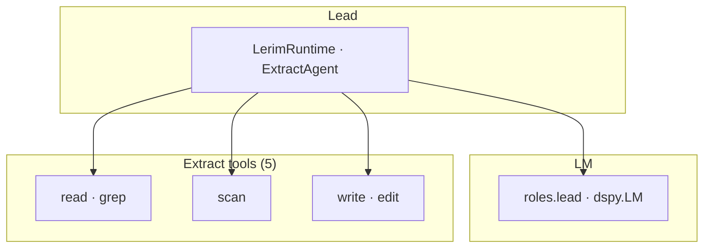
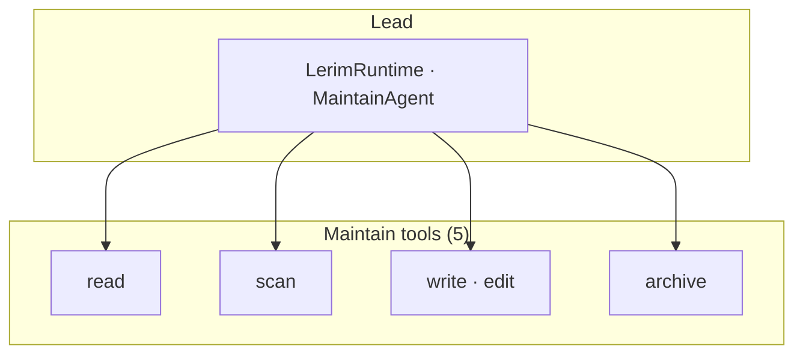

<p align="center">
  
</p>

<h3 align="center">The context graph layer for coding agents.<br>Lerim extracts the decisions, the reasoning, and the <em>why</em> -- so no agent starts blind.</h3>

<p align="center">
  <a href="https://pypi.org/project/lerim/"></a>
  <a href="https://pypi.org/project/lerim/"></a>
  <a href="https://github.com/lerim-dev/lerim-cli/blob/main/LICENSE"></a>
  <a href="https://github.com/lerim-dev/lerim-cli/actions"></a>
  <a href="https://github.com/lerim-dev/lerim-cli"></a>
</p>

<p align="center"><a href="https://lerim.dev/">lerim.dev</a> · <a href="https://docs.lerim.dev/">docs</a> · <a href="https://pypi.org/project/lerim/">pypi</a></p>

## The Problem

> AI agents decide fast -- but the reasoning is lost after every session. Every decision, every "we tried X and it didn't work," every architectural choice -- gone.

> And if you use multiple agents -- Claude Code at the terminal, Cursor in the IDE, Codex for reviews -- none of them know what the others learned. The *why* behind your project is **scattered across isolated sessions, lost between agents**.

> Everyone stores memory. Nobody extracts the reasoning.

## The Solution

Lerim is a **continual learning layer** for coding agents -- it watches sessions, extracts durable decisions and learnings, and stores them as plain markdown so every agent can reuse them later.

- **Watches** your agent sessions across all supported coding agents
- **Extracts** the reasoning behind decisions -- the *why*, not just the *what* -- using a DSPy ReAct lead agent (`LerimRuntime`)
- **Stores** everything as plain markdown files in your repo (`.lerim/`)
- **Refines** knowledge over time -- the maintain flow merges duplicates, archives low-value entries, and refreshes `index.md`
- **Unifies** knowledge across agents -- what one session stores, the next can read via the same memory files
- **Answers** questions about past context: `lerim ask "why did we choose Postgres?"`

No proprietary format. No database lock-in. Just markdown files that both humans and agents can read. Knowledge compounds over time, not stale.

## Supported Agents

Lerim works with any coding agent that produces session traces. Current adapters:

| Agent | Session Format | Status |
|-------|---------------|--------|
| Claude Code | JSONL traces | Supported |
| Codex CLI | JSONL traces | Supported |
| Cursor | SQLite to JSONL | Supported |
| OpenCode | SQLite to JSONL | Supported |

*Adding a new agent adapter is straightforward -- PRs welcome! See `src/lerim/adapters/` for examples.*

## How It Works

Lerim is file-first.

- Memory types: `user`, `feedback`, `project`, `reference`
- Flat layout: `memory/*.md` (plus `memory/summaries/`)
- Project memory: `<repo>/.lerim/`
- Global fallback: `~/.lerim/`
- Search: file-based (`lerim memory search`, `lerim ask`)
- Orchestration: DSPy ReAct (`LerimRuntime`) with per-flow tools; the **lead** model (`[roles.lead]`) drives sync, maintain, and ask via `dspy.LM`

### Sync path

One **ExtractAgent** (DSPy ReAct, max_iters=15) runs per session. It uses **`[roles.lead]`** as its language model and calls **5 tools** from a [`MemoryTools`](src/lerim/agents/tools.py) instance: `read` the trace, `grep` for patterns, `scan` existing memories, dedupe via `write` / `edit`, and write summaries via `write(type="summary")`.


```mermaid
flowchart TB
    subgraph lead["Lead"]
        RT[LerimRuntime · ExtractAgent]
    end
    subgraph lm["LM"]
        L[roles.lead · dspy.LM]
    end
    subgraph syncTools["Extract tools (5)"]
        t1["read · grep"]
        sm[scan]
        wm["write · edit"]
    end
    RT --> L
    RT --> t1
    RT --> sm
    RT --> wm
```

Before that run, adapters **discover** sessions, **index** them, and **compact** traces — then the agent decides what to remember and writes markdown under `.lerim/memory/`.

### Maintain path

Same **lead** model, different tools: **MaintainAgent** (max_iters=30) uses **5 tools** from a [`MemoryTools`](src/lerim/agents/tools.py) instance — `scan` the manifest, `read` files, merge or archive memories via `write`, `edit`, and `archive`.


```mermaid
flowchart TB
    subgraph lead_m["Lead"]
        RT_m[LerimRuntime · MaintainAgent]
    end
    subgraph maintainTools["Maintain tools (5)"]
        t2[read]
        sm2[scan]
        wm2["write · edit"]
        ar[archive]
    end
    RT_m --> t2
    RT_m --> sm2
    RT_m --> wm2
    RT_m --> ar
```

The maintainer prompt guides merge, archive, consolidate, and re-index — the agent chooses **how** to use the tools above.

## Quick start

### 1. Install

```bash
pip install lerim
```

Prerequisites: Python 3.10+, [Docker](https://docs.docker.com/get-docker/) (optional)

### 2. Set up

```bash
lerim init                     # interactive setup — detects your coding agents
lerim project add .            # add current project (repeat for other repos)
```

### 3. Set API keys

`lerim init` walks you through provider selection and saves keys to `~/.lerim/.env`.
You can also create it manually:

```bash
# ~/.lerim/.env
OPENCODE_API_KEY=your-key-here
# Add more keys if using multiple providers or fallbacks
```

**Supported providers:**

| Provider | Env var | Config `provider =` |
|----------|---------|-------------------|
| OpenCode Go | `OPENCODE_API_KEY` | `"opencode_go"` |
| OpenRouter | `OPENROUTER_API_KEY` | `"openrouter"` |
| OpenAI | `OPENAI_API_KEY` | `"openai"` |
| MiniMax | `MINIMAX_API_KEY` | `"minimax"` |
| Z.AI | `ZAI_API_KEY` | `"zai"` |
| Anthropic | `ANTHROPIC_API_KEY` | `"anthropic"` |
| Ollama (local) | — | `"ollama"` |

**Provider and fallback configuration** in `~/.lerim/config.toml`:

```toml
[roles.lead]
provider = "opencode_go"          # primary provider
model = "minimax-m2.5"            # model name
fallback_models = ["minimax:minimax-m2.5", "zai:glm-4.7"]  # auto-switch on rate limits
```

Set API keys for your primary provider and any fallbacks.

### 4. Start Lerim

```bash
lerim up
```

That's it. Lerim is now running as a Docker service — syncing sessions, extracting
memories, refining them, and exposing the JSON API at `http://localhost:8765`.
Use **[Lerim Cloud](https://lerim.dev)** for the web UI (session analytics, memories, settings).

### 5. Teach your agent about Lerim

Install the Lerim skill so your agent knows how to query past context:

```bash
lerim skill install
```

This copies bundled skill files (`SKILL.md`, `cli-reference.md`) into
`~/.agents/skills/lerim/` (shared by Cursor, Codex, OpenCode, …) and
`~/.claude/skills/lerim/` (Claude Code).

### 6. Get the most out of Lerim

At the start of a session, tell your agent:

> Check lerim for any relevant memories about [topic you're working on].

Your agent will run `lerim ask` to pull in past memories before it starts working.

### Running without Docker

If you prefer not to use Docker, Lerim works directly:

```bash
lerim connect auto             # detect agent platforms
lerim serve                    # run HTTP server + daemon loop
```

### Local models (Ollama)

Lerim works with local models via [Ollama](https://ollama.com). Set `provider = "ollama"` in your role config and Lerim will automatically load models into GPU/RAM before each sync/maintain cycle and unload them after to free memory (`auto_unload = true` in `[providers]`).

```bash
ollama serve                   # start Ollama (runs outside Docker)
```

For Docker deployments, set `ollama = "http://host.docker.internal:11434"` in `[providers]` so the container can reach the host Ollama instance. See [model roles](https://docs.lerim.dev/configuration/model-roles/) for full configuration.

## Web UI (Lerim Cloud)

The web dashboard has moved to **[lerim.dev](https://lerim.dev)**. The local bundled dashboard has been removed as of v0.1.70 -- all UI features (sessions, memories, pipeline, settings) are now part of **[Lerim Cloud](https://lerim.dev)**. The `lerim` daemon still exposes a **JSON API** on `http://localhost:8765` for the CLI and for Cloud to talk to your local runtime when connected. Running `lerim dashboard` shows a transition message with CLI alternatives.

## CLI reference

Full command reference: [`src/lerim/skills/cli-reference.md`](src/lerim/skills/cli-reference.md)

```bash
# Setup (host-only)
lerim init                                  # interactive setup wizard
lerim project add ~/codes/my-app            # register a project
lerim project list                          # list registered projects

# Docker service
lerim up                                    # start Lerim container
lerim down                                  # stop it
lerim logs --follow                         # tail logs

# Alternative: run directly without Docker
lerim serve                                 # start HTTP server + daemon loop

# Service commands (require lerim up or lerim serve running)
lerim ask "Why did we choose this?"          # query memories
lerim sync                                  # one-shot: sync sessions + extract
lerim maintain                              # one-shot: merge, archive, decay
lerim status                                # runtime state
lerim queue                                 # show pending session queue

# Local commands (run on host, no server needed)
lerim memory list                           # list all memories
lerim connect auto                          # detect and connect platforms
lerim skill install                         # install skill into agent directories
```

### Configuration

TOML-layered config (low to high priority):

1. `src/lerim/config/default.toml` (shipped with package -- all defaults)
2. `~/.lerim/config.toml` (user global)
3. `<repo>/.lerim/config.toml` (project overrides)
4. `LERIM_CONFIG` env var path (explicit override, for CI/tests)

API keys come from environment variables only. Set keys for the providers you use:

| Variable | Provider | Default role |
|----------|----------|-------------|
| `OPENCODE_API_KEY` | OpenCode Go / Zen | Common default (see `default.toml`) |
| `MINIMAX_API_KEY` | MiniMax | When `provider = "minimax"` |
| `ZAI_API_KEY` | Z.AI | When using Z.AI |
| `OPENROUTER_API_KEY` | OpenRouter | Optional |
| `OPENAI_API_KEY` | OpenAI | Optional |
| `ANTHROPIC_API_KEY` | Anthropic | Optional |

Default model config (see `src/lerim/config/default.toml` — values change with releases):

- Example defaults: `provider = "opencode_go"`, `model = "minimax-m2.5"` for lead, extract, and summarize; `fallback_models` on the lead role for quota errors.

### Development

```bash
uv venv && source .venv/bin/activate
uv pip install -e '.[test]'
lerim init                    # first-time config
lerim project add .           # track this repo
lerim up                      # start the service
tests/run_tests.sh unit
tests/run_tests.sh all
```

### Tracing (OpenTelemetry)

When enabled, tracing uses Logfire (OpenTelemetry): `logfire.instrument_dspy()` covers all DSPy ReAct agents, extraction, and summarization; optional httpx captures raw LLM HTTP traffic.

```bash
# Enable tracing
LERIM_TRACING=1 lerim sync

# or in config
# .lerim/config.toml
[tracing]
enabled = true
```

## Memory layout

Project scope:

```text
<repo>/.lerim/
  config.toml              # project overrides
  memory/
    *.md                  # flat layout (types: user, feedback, project, reference)
    summaries/
      {YYYYMMDD}-{slug}.md
    archived/
      *.md
  workspace/
    sync-<YYYYMMDD-HHMMSS>-<shortid>/
    maintain-<YYYYMMDD-HHMMSS>-<shortid>/
  index/   # reserved
```

Global fallback scope follows the same layout under `~/.lerim/`.

## Contributing

Lerim is open to contributions. Whether it's a new agent adapter, a bug fix, or a documentation improvement, PRs are welcome.

- Read the [Contributing Guide](https://docs.lerim.dev/contributing/getting-started/)
- Browse [open issues](https://github.com/lerim-dev/lerim-cli/issues)
- Agent adapter PRs are especially appreciated -- see `src/lerim/adapters/` for examples

## Docs

Full documentation: [docs.lerim.dev](https://docs.lerim.dev)

- [Quickstart](https://docs.lerim.dev/quickstart/)
- [Installation](https://docs.lerim.dev/installation/)
- [CLI Reference](https://docs.lerim.dev/cli/overview/)
- [Configuration](https://docs.lerim.dev/configuration/overview/)
- [Architecture](https://docs.lerim.dev/architecture/overview/)
- [Contributing](https://docs.lerim.dev/contributing/getting-started/)

---

<p align="center">
  <strong>If your agents keep re-debating the same decisions, give Lerim a ⭐</strong><br>
  <a href="https://github.com/lerim-dev/lerim-cli">Star on GitHub</a>
</p>
