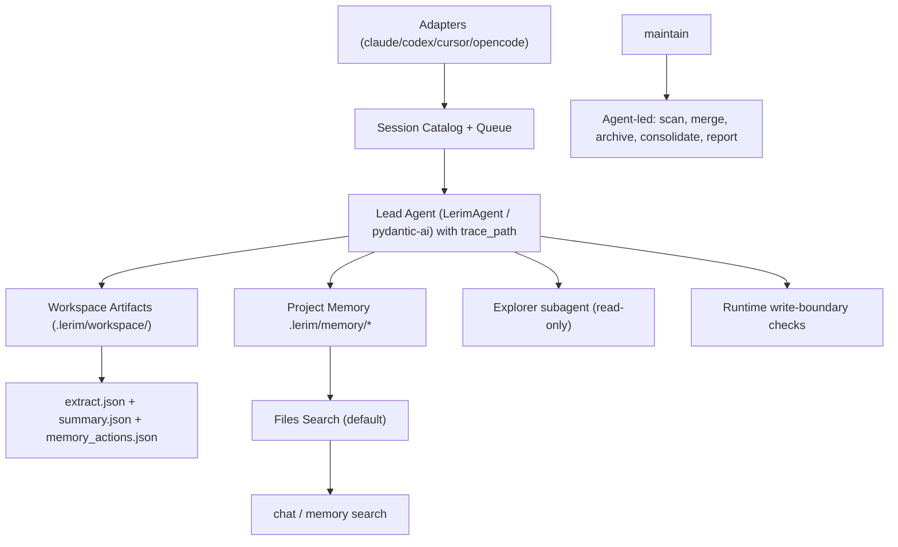

# Lerim Architecture

Last updated: 2026-02-23

## Summary

Lerim is a file-first continual learning layer for coding agents.

1. Ingest sessions from local agent adapters.
2. Lead runtime takes only `trace_path` and creates one per-run workspace folder.
3. Orchestration runs on `pydantic-ai` with typed tools and read-only subagent delegation.
4. Extraction/summarization run through `dspy.RLM` tool calls and write `extract.json` + `summary.json`.
5. Lead decides `add|update|no-op` by deterministic prompt policy and writes markdown files (`decision`, `learning`) plus one episodic `summary`.
6. Run evidence is stored as flat artifacts in the workspace folder.
7. Retrieve with project-first scope and global fallback.

## Runtime prerequisites

`dspy.RLM` runs through DSPy's Deno/Pyodide interpreter. Install Deno on host machines that run extraction.

```bash
brew install deno
deno --version
```

## System flow



## Storage model

Canonical memory files:

- `.lerim/memory/decisions/*.md`
- `.lerim/memory/learnings/*.md`
- `.lerim/memory/summaries/YYYYMMDD/HHMMSS/{slug}.md`
- `.lerim/memory/archived/decisions/*.md` (soft-deleted)
- `.lerim/memory/archived/learnings/*.md` (soft-deleted)

Trace archive:

- `.lerim/meta/traces/sessions/<agent>/<run_id>.jsonl`

Run workspace artifacts:

Sync runs:
- `.lerim/workspace/sync-<YYYYMMDD-HHMMSS>-<shortid>/extract.json`
- `.lerim/workspace/sync-<YYYYMMDD-HHMMSS>-<shortid>/summary.json`
- `.lerim/workspace/sync-<YYYYMMDD-HHMMSS>-<shortid>/memory_actions.json`
- `.lerim/workspace/sync-<YYYYMMDD-HHMMSS>-<shortid>/agent.log`
- `.lerim/workspace/sync-<YYYYMMDD-HHMMSS>-<shortid>/subagents.log`
- `.lerim/workspace/sync-<YYYYMMDD-HHMMSS>-<shortid>/session.log`

Maintain runs:
- `.lerim/workspace/maintain-<YYYYMMDD-HHMMSS>-<shortid>/maintain_actions.json`
- `.lerim/workspace/maintain-<YYYYMMDD-HHMMSS>-<shortid>/agent.log`
- `.lerim/workspace/maintain-<YYYYMMDD-HHMMSS>-<shortid>/subagents.log`

Index folder:

- `.lerim/index/fts.sqlite3`
- `.lerim/index/graph.sqlite3`
- `.lerim/index/vectors.lance/`

## Scope resolution

Config precedence (low to high priority):

1. `src/lerim/config/default.toml` (shipped with package)
2. `~/.lerim/config.toml` (user global)
3. `<repo>/.lerim/config.toml` (project overrides)
4. `LERIM_CONFIG` env var path (explicit override, for CI/tests)

API keys come from environment variables only (`ZAI_API_KEY`, `OPENROUTER_API_KEY`, `OPENAI_API_KEY`, optional `ANTHROPIC_API_KEY`).

Memory scope modes:

- `project_fallback_global` (default)
- `project_only`
- `global_only`

## Related references

Explicit ID/slug references are used for graph linking (`related` is optional when present).

- No wikilink dependency in prompts or storage
- No required parser layer for `[[...]]` syntax

## Runtime paths

- `sync`: discover/index sessions, run lead by `trace_path`, write run artifacts to workspace folder, run lead decision (`add|update|no-op`), write memory + summaries.
- `maintain`: agent-led offline memory refinement. Scans existing memories, merges duplicates, archives low-value entries, consolidates related memories. Soft-deletes to `archived/` via the `write` tool. Single agent run with comprehensive prompt.
- Query path (`chat`, `memory search`) is read-only.

## Observability

Stderr logging is minimal (short status lines via loguru). Detailed agent tracing
uses OpenTelemetry through PydanticAI's built-in instrumentation (`logfire` SDK with
`send_to_logfire=False`).

When tracing is enabled (`LERIM_TRACING=1` or `[tracing] enabled = true`):

- Each `agent.run_sync()` emits a trace with spans for model requests, tool calls, and timing.
- Token usage is recorded per span.
- Optional `include_httpx = true` captures raw HTTP request/response bodies.
- Traces are sent to Logfire cloud (free tier). View at https://logfire.pydantic.dev.
- DSPy pipelines run with `verbose=False`; their LLM calls are visible via httpx spans when enabled.

Implementation: `src/lerim/config/tracing.py` (called once at CLI startup before agent construction).

Security boundary for memory-write flow:

- Runtime tools deny `write` and `edit` outside `memory_root` and workspace roots.
- Memory writes are normalized to canonical markdown frontmatter and filename rules.
- All file operations use Python tools (no shell/subprocess).
- Explorer subagent is read-only (`read`, `glob`, `grep` only).
