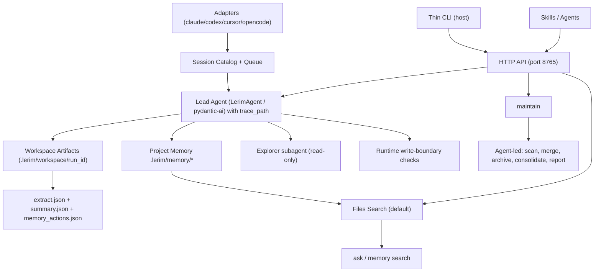

# Architecture

Last updated: 2026-02-28

## Summary

Lerim is a file-first continual learning layer for coding agents.

1. Ingest sessions from local agent adapters.
2. Lead runtime takes only `trace_path` and creates one per-run workspace folder.
3. Orchestration runs on `pydantic-ai` with typed tools and read-only subagent delegation.
4. Extraction/summarization run through `dspy.RLM` tool calls and write `extract.json` + `summary.json`.
5. Lead decides `add|update|no-op` by deterministic prompt policy and writes markdown files (`decision`, `learning`) plus one episodic `summary`.
6. Run evidence is stored as flat artifacts in the workspace folder.
7. Retrieve with project-first scope and global fallback.

## Deployment model

Lerim runs as a single process (`lerim serve`) that provides the daemon + HTTP API + dashboard. Typically this runs inside a Docker container via `lerim up`, but can also be started directly for development. Service commands (`ask`, `sync`, `maintain`, `status`) are thin HTTP clients that forward to the server (`localhost:8765`). Skills and agents can also call the HTTP API directly.

```
CLI / clients                       lerim serve (Docker or direct)
─────────────                       ──────────────────────────────
lerim ask "q"   ──HTTP POST──►     /api/ask
lerim sync      ──HTTP POST──►     /api/sync
lerim status    ──HTTP GET───►     /api/status
skills (curl)   ──HTTP───────►     /api/*
browser         ──HTTP───────►     dashboard UI

lerim init        (host only)
lerim project add (host only)
lerim up/down     (host only)
```

Setup: `pip install lerim && lerim init && lerim project add . && lerim up`

## Runtime prerequisites

- **Docker** — required for the always-on service (`lerim up`)
- **Deno** — required inside the container by `dspy.RLM` (baked into the Docker image)
- **Python 3.10+** — required on the host for `pip install lerim` (init, project management)

## System flow



## Storage model

Canonical memory files:

- `.lerim/memory/decisions/*.md`
- `.lerim/memory/learnings/*.md`
- `.lerim/memory/summaries/YYYYMMDD/HHMMSS/{slug}.md`
- `.lerim/memory/archived/decisions/*.md` (soft-deleted)
- `.lerim/memory/archived/learnings/*.md` (soft-deleted)

Trace archive:

- `.lerim/meta/traces/sessions/<agent>/<run_id>.jsonl`

Run workspace artifacts:

- `.lerim/workspace/sync-<YYYYMMDD-HHMMSS>-<shortid>/` — extract.json, summary.json, memory_actions.json, agent.log, subagents.log, session.log
- `.lerim/workspace/maintain-<YYYYMMDD-HHMMSS>-<shortid>/` — maintain_actions.json, agent.log, subagents.log

Index folder (reserved for future FTS/vector/graph):

- `.lerim/index/fts.sqlite3`
- `.lerim/index/graph.sqlite3`
- `.lerim/index/vectors.lance/`

## Scope resolution

Config precedence (low to high priority):

1. `src/lerim/config/default.toml` (shipped with package)
2. `~/.lerim/config.toml` (user global)
3. `<repo>/.lerim/config.toml` (project overrides)
4. `LERIM_CONFIG` env var path (explicit override, for CI/tests)

API keys come from environment variables only (`ZAI_API_KEY`, `OPENROUTER_API_KEY`, `OPENAI_API_KEY`, optional `ANTHROPIC_API_KEY`).

Memory scope modes:

- `project_fallback_global` (default)
- `project_only`
- `global_only`

## Runtime paths

### Sync path

<p align="center">
  
</p>

**sync**: discover/index sessions, run lead by `trace_path`, write run artifacts to workspace folder, run lead decision (`add|update|no-op`), write memory + summaries.

### Maintain path

<p align="center">
  
</p>

**maintain**: agent-led offline memory refinement. Scans existing memories, merges duplicates, archives low-value entries, consolidates related memories. Soft-deletes to `archived/` via the `write` tool. Single agent run with comprehensive prompt.

### Query path

**query** (`ask`, `memory search`): read-only path.

## Agent architecture

### Lead agent

The lead agent (PydanticAI) orchestrates all flows. It is the only component allowed to write memory files.

- **Runtime tools**: `read`, `glob`, `grep`, `write`, `edit`, `extract_pipeline`, `summarize_pipeline`
- **Write boundary**: runtime tools deny writes outside `memory_root` and workspace roots
- **All file operations** use Python tools (no shell/subprocess)

### Explorer subagent

Read-only agent delegated from the lead for candidate gathering:

- **Tools**: `read`, `glob`, `grep` only
- **Cannot write** — no write or edit tools

### DSPy pipelines

Called as tools from the lead agent:

- **Extraction** (`MemoryExtractSignature`): transcript -> structured memory candidates
- **Summarization** (`TraceSummarySignature`): transcript -> structured summary with frontmatter

Both run through `dspy.RLM` with role-configured models.

## Observability

Stderr logging is minimal (short status lines via loguru). Detailed agent tracing uses OpenTelemetry through PydanticAI's built-in instrumentation (`logfire` SDK).

When tracing is enabled (`LERIM_TRACING=1` or `[tracing] enabled = true`):

- Each `agent.run_sync()` emits a trace with spans for model requests, tool calls, and timing
- Token usage is recorded per span
- Optional `include_httpx = true` captures raw HTTP request/response bodies
- Traces are sent to Logfire cloud (free tier) — view at [logfire.pydantic.dev](https://logfire.pydantic.dev)
- DSPy pipelines run with `verbose=False`; their LLM calls are visible via httpx spans when enabled

## HTTP API

The dashboard HTTP server exposes a JSON API that serves as the canonical interface
for the thin CLI, skills, agents, and the dashboard UI.

Key endpoints:

| Method | Endpoint | Purpose |
|--------|----------|---------|
| GET | `/api/health` | Health check (Docker HEALTHCHECK + CLI detection) |
| GET | `/api/status` | Runtime state |
| POST | `/api/ask` | Query memories |
| POST | `/api/sync` | Trigger sync |
| POST | `/api/maintain` | Trigger maintenance |
| GET | `/api/memories` | List memories |
| GET | `/api/search` | Search memories |
| GET | `/api/connect` | List connected platforms |
| POST | `/api/connect` | Connect a platform |
| GET | `/api/project/list` | List registered projects |
| POST | `/api/project/add` | Register a project |

Full endpoint list in `src/lerim/app/dashboard.py`.

## Security boundaries

- Runtime tools deny `write` and `edit` outside `memory_root` and workspace roots
- Memory writes are normalized to canonical markdown frontmatter and filename rules
- All file operations use Python tools (no shell/subprocess)
- Explorer subagent is read-only (`read`, `glob`, `grep` only)
- HTTP API binds to `127.0.0.1` by default (localhost only, no auth needed)
