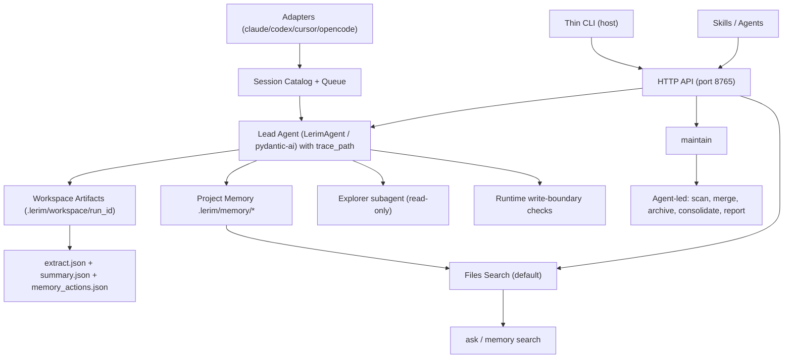

# Architecture

Last updated: 2026-03-01

## Summary

Lerim is a file-first continual learning layer for coding agents.

1. Ingest sessions from local agent adapters.
2. Lead runtime takes only `trace_path` and creates one per-run workspace folder.
3. Orchestration runs on `pydantic-ai` with typed tools and read-only subagent delegation.
4. Extraction/summarization run through `dspy.ChainOfThought` with transcript windowing and write `extract.json` + `summary.json`.
5. Lead decides `add|update|no-op` by deterministic prompt policy and writes markdown files (`decision`, `learning`) plus one episodic `summary`.
6. Run evidence is stored as flat artifacts in the workspace folder.
7. Retrieve with project-scoped memory (global fallback not yet implemented).

## Deployment model

Lerim runs as a single process (`lerim serve`) that provides the daemon + HTTP API + dashboard. Typically this runs inside a Docker container via `lerim up`, but can also be started directly for development. Service commands (`ask`, `sync`, `maintain`, `status`) are thin HTTP clients that forward to the server (`localhost:8765`). Skills and agents can also call the HTTP API directly.

```
CLI / clients                       lerim serve (Docker or direct)
─────────────                       ──────────────────────────────
lerim ask "q"   ──HTTP POST──►     /api/ask
lerim sync      ──HTTP POST──►     /api/sync
lerim status    ──HTTP GET───►     /api/status
skills (curl)   ──HTTP───────►     /api/*
browser         ──HTTP───────►     dashboard UI

lerim init        (host only)
lerim project add (host only)
lerim up/down     (host only)
```

Setup: `pip install lerim && lerim init && lerim project add . && lerim up`

## Runtime prerequisites

- **Docker** — required for the always-on service (`lerim up`)
- **Python 3.10+** — required on the host for `pip install lerim` (init, project management)

## System flow


```mermaid
flowchart TD
    A["Adapters (claude/codex/cursor/opencode)"] --> B["Session Catalog + Queue"]
    B --> C["Lead Agent (LerimAgent / pydantic-ai) with trace_path"]
    C --> D["Workspace Artifacts (.lerim/workspace/run_id)"]
    D --> E["extract.json + summary.json + memory_actions.json"]
    C --> F["Project Memory .lerim/memory/*"]
    C --> O["Explorer subagent (read-only)"]
    C --> P["Runtime write-boundary checks"]

    F --> H["Files Search (default)"]
    H --> L["ask / memory search"]

    M["maintain"] --> N["Agent-led: scan, merge, archive, consolidate, report"]

    API["HTTP API (port 8765)"] --> C
    API --> H
    API --> M
    CLI["Thin CLI (host)"] --> API
    SKILLS["Skills / Agents"] --> API
```

## Storage model

### Per-project: `<repo>/.lerim/`

Each registered project stores its own memories and run artifacts:

- `memory/decisions/*.md` — decision memory files
- `memory/learnings/*.md` — learning memory files
- `memory/summaries/YYYYMMDD/HHMMSS/{slug}.md` — session summaries
- `memory/archived/decisions/*.md`, `memory/archived/learnings/*.md` — soft-deleted
- `workspace/sync-<YYYYMMDD-HHMMSS>-<shortid>/` — sync run artifacts (extract.json, summary.json, memory_actions.json, agent.log, subagents.log, session.log)
- `workspace/maintain-<YYYYMMDD-HHMMSS>-<shortid>/` — maintain run artifacts (maintain_actions.json, agent.log, subagents.log)
- `index/memories.sqlite3` — memory access tracker (last accessed, access count; used by decay/archiving)

### Global: `~/.lerim/`

Shared across all projects:

- `config.toml` — user configuration
- `index/sessions.sqlite3` — session catalog, FTS index (virtual table inside same DB), job queue, service run log
- `cache/` — session trace caches per platform (claude, codex, cursor, opencode)
- `activity.log` — append-only activity log (one line per sync/maintain cycle with project, stats, duration)
- `docker-compose.yml` — generated by `lerim up`
- `platforms.json` — platform detection cache

### Scope behavior

- Sync routes memories to the correct `<repo>/.lerim/memory/` per project based on session `repo_path`. Sessions that don't match any registered project are indexed in `sessions.sqlite3` but not extracted.
- Maintain iterates over all registered projects in `config.projects`, running decay/archive/consolidation for each project's memory root.
- The `project_fallback_global` scope mode exists in config but global memory fallback is not implemented — memories are always per-project.

## Scope resolution

Config precedence (low to high priority):

1. `src/lerim/config/default.toml` (shipped with package)
2. `~/.lerim/config.toml` (user global)
3. `<repo>/.lerim/config.toml` (project overrides)
4. `LERIM_CONFIG` env var path (explicit override, for CI/tests)

API keys come from environment variables only (`ZAI_API_KEY`, `OPENROUTER_API_KEY`, `OPENAI_API_KEY`, optional `ANTHROPIC_API_KEY`).

Memory scope modes (configured via `[memory] scope`):

- `project_fallback_global` (default) — memories stored per-project; global fallback is configured but not yet implemented in the runtime
- `project_only` — memories stored per-project only
- `global_only` — memories stored in `~/.lerim/memory/` (for use outside git repos)

## Runtime paths

### Sync path

<p align="center">
  
</p>

**sync**: discover/index sessions, run lead by `trace_path`, write run artifacts to workspace folder, run lead decision (`add|update|no-op`), write memory + summaries.

### Maintain path

<p align="center">
  
</p>

**maintain**: agent-led offline memory refinement. Iterates over all registered projects, running a separate agent for each project's memory root. Scans existing memories, merges duplicates, archives low-value entries, consolidates related memories. Creates new consolidated memories via `write_memory`, soft-deletes to `archived/` via `write`.

### Query path

**query** (`ask`, `memory search`): read-only path.

## Agent architecture

### Lead agent

The lead agent (PydanticAI) orchestrates all flows. It is the only component allowed to write memory files.

- **Runtime tools**: `read`, `glob`, `grep`, `write`, `write_memory`, `edit`, `extract_pipeline`, `summarize_pipeline`
- **Write boundary**: runtime tools deny writes outside `memory_root` and workspace roots
- **All file operations** use Python tools (no shell/subprocess)

### Explorer subagent

Read-only agent delegated from the lead for candidate gathering:

- **Tools**: `read`, `glob`, `grep` only
- **Cannot write** — no write or edit tools

### DSPy pipelines

Called as tools from the lead agent:

- **Extraction** (`MemoryExtractSignature`): transcript -> windowed ChainOfThought -> per-window candidates -> merge -> structured memory candidates
- **Summarization** (`TraceSummarySignature`): transcript -> windowed ChainOfThought -> partial summaries -> merge -> structured summary with frontmatter

Both run through `dspy.ChainOfThought` with transcript windowing (configurable via `max_window_tokens` and `window_overlap_tokens` per role). Large transcripts are split into overlapping windows, processed independently, then merged in a final ChainOfThought call.

## Observability

Stderr logging is minimal (short status lines via loguru). Detailed agent tracing uses OpenTelemetry through PydanticAI's built-in instrumentation (`logfire` SDK).

When tracing is enabled (`LERIM_TRACING=1` or `[tracing] enabled = true`):

- Each `agent.run_sync()` emits a trace with spans for model requests, tool calls, and timing
- Token usage is recorded per span
- Optional `include_httpx = true` captures raw HTTP request/response bodies
- Traces are sent to Logfire cloud (free tier) — view at [logfire.pydantic.dev](https://logfire.pydantic.dev)
- DSPy pipelines run with `verbose=False`; their LLM calls are visible via httpx spans when enabled

## HTTP API

The dashboard HTTP server exposes a JSON API that serves as the canonical interface
for the thin CLI, skills, agents, and the dashboard UI.

Key endpoints:

| Method | Endpoint | Purpose |
|--------|----------|---------|
| GET | `/api/health` | Health check (Docker HEALTHCHECK + CLI detection) |
| GET | `/api/status` | Runtime state |
| POST | `/api/ask` | Query memories |
| POST | `/api/sync` | Trigger sync |
| POST | `/api/maintain` | Trigger maintenance |
| GET | `/api/memories` | List memories |
| GET | `/api/search` | Search memories |
| GET | `/api/connect` | List connected platforms |
| POST | `/api/connect` | Connect a platform |
| GET | `/api/project/list` | List registered projects |
| POST | `/api/project/add` | Register a project |

Full endpoint list in `src/lerim/app/dashboard.py`.

## Security boundaries

- Runtime tools deny `write` and `edit` outside `memory_root` and workspace roots
- Memory files (decisions/learnings) can only be created via `write_memory` tool, which accepts structured fields and builds markdown in Python — the LLM never assembles frontmatter directly
- `write` tool rejects memory primitive paths with `ModelRetry`, directing the LLM to use `write_memory` instead
- All file operations use Python tools (no shell/subprocess)
- Explorer subagent is read-only (`read`, `glob`, `grep` only)
- HTTP API binds to `127.0.0.1` by default (localhost only, no auth needed)
