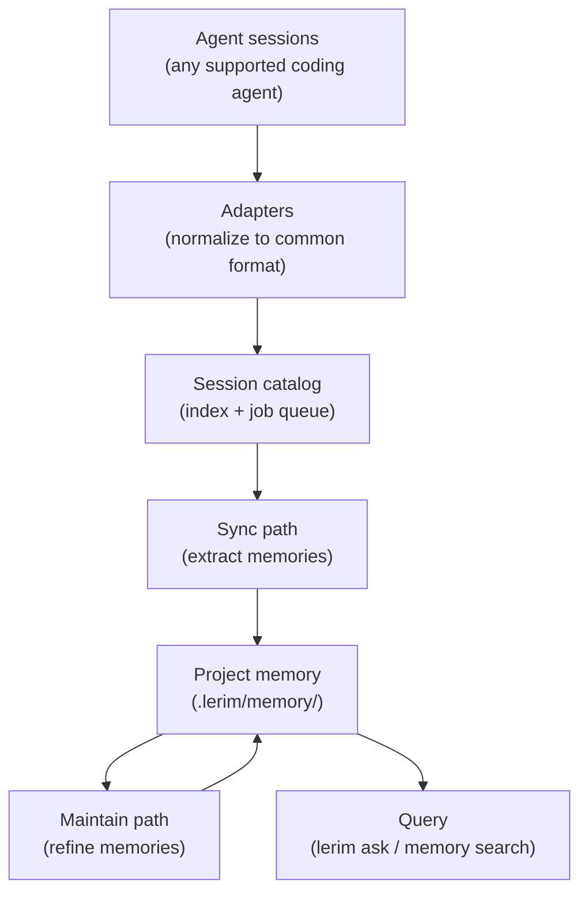
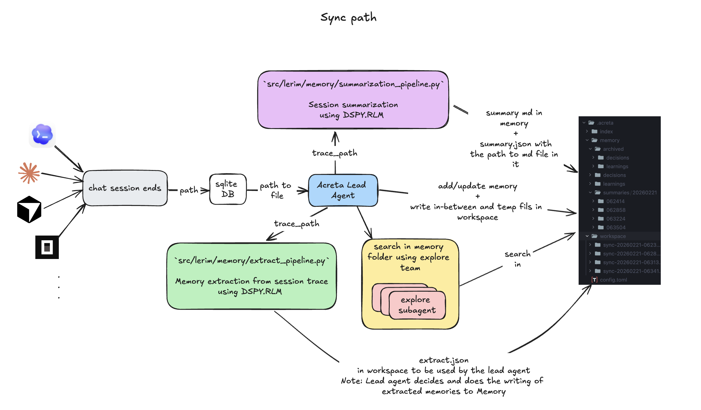

# How It Works

Lerim is the **continual learning layer** for AI coding agents. It watches your agent sessions, extracts decisions and learnings, and makes that knowledge available to every agent on every future session.

---

## Core principles

<div class="grid cards" markdown>

-   :material-file-document-outline:{ .lg .middle } **File-first**

    ---

    Memories are plain markdown files with YAML frontmatter. No database required -- files are the canonical store. Humans and agents can read them directly.

-   :material-folder-account:{ .lg .middle } **Project-scoped**

    ---

    Each project gets its own `.lerim/` directory. Memories are isolated per-repo so different projects don't mix.

-   :material-transit-connection-variant:{ .lg .middle } **Agent-agnostic**

    ---

    Works with any coding agent that produces session traces. Platform adapters normalize different formats into a common pipeline.

-   :material-refresh:{ .lg .middle } **Self-maintaining**

    ---

    Memories are automatically refined over time -- duplicates merged, stale entries archived, related learnings consolidated.

</div>

---

## Data flow

Lerim has two runtime paths that work together: **sync** (hot path) and **maintain** (cold path).



---

## Sync path (hot)

The sync path processes new agent sessions and turns them into memories.



1. **Discover** -- adapters scan session directories for new sessions within the time window (default: last 7 days)
2. **Index** -- new sessions are cataloged with metadata (agent type, repo path, timestamps)
3. **Compact** -- traces are compacted by stripping tool outputs and reasoning blocks (typically 40-90% size reduction), cached in `~/.lerim/cache/`
4. **Extract** -- DSPy pipelines extract decision and learning candidates from the compacted transcript
5. **Deduplicate** -- the lead agent compares candidates against existing memories and decides: add, update, or skip
6. **Write** -- new memories are written as markdown files to `.lerim/memory/`
7. **Summarize** -- an episodic summary of the session is generated and saved

---

## Maintain path (cold)

The maintain path refines existing memories offline.


1. **Scan** -- reads all active memories in the project
2. **Merge duplicates** -- combines memories covering the same concept
3. **Archive low-value** -- soft-deletes memories with low effective confidence
4. **Consolidate** -- combines related memories into richer entries
5. **Apply decay** -- reduces confidence of memories not accessed recently

---

## Deployment model

Lerim runs as a **single process** (`lerim serve`) that provides the daemon loop, HTTP API, and dashboard. Typically this runs inside a Docker container via `lerim up`, but can also be started directly.

Service commands (`ask`, `sync`, `maintain`, `status`) are thin HTTP clients that forward requests to the server.

```
CLI / clients                       lerim serve (Docker or direct)
-----                               --------
lerim ask "q"   --HTTP POST-->      /api/ask
lerim sync      --HTTP POST-->      /api/sync
lerim maintain  --HTTP POST-->      /api/maintain
lerim status    --HTTP GET--->      /api/status
browser         --HTTP-------->     dashboard UI (port 8765)

lerim init        (host only, no server needed)
lerim project add (host only, no server needed)
lerim up/down     (host only, manages Docker)
```

=== "Docker (recommended)"

    ```bash
    pip install lerim
    lerim init
    lerim project add .
    lerim up                    # starts container with daemon + API + dashboard
    ```

=== "Direct (development)"

    ```bash
    pip install lerim
    lerim init
    lerim connect auto
    lerim serve                 # starts daemon + API + dashboard in foreground
    ```

---

## Storage model

### Per-project: `<repo>/.lerim/`

```text
<repo>/.lerim/
├── memory/
│   ├── decisions/*.md           # decision memory files
│   ├── learnings/*.md           # learning memory files
│   ├── summaries/YYYYMMDD/      # session summaries
│   └── archived/                # soft-deleted memories
└── workspace/                   # run artifacts (logs, extraction results)
```

### Global: `~/.lerim/`

```text
~/.lerim/
├── config.toml                  # user global configuration
├── index/sessions.sqlite3       # session catalog + job queue
├── cache/                       # compacted trace caches per platform
├── activity.log                 # append-only activity log
└── platforms.json               # platform detection cache
```

---

## Next steps

<div class="grid cards" markdown>

-   :material-brain:{ .lg .middle } **Memory Model**

    ---

    Learn about memory primitives, lifecycle, and decay.

    [:octicons-arrow-right-24: Memory model](memory-model.md)

-   :material-robot:{ .lg .middle } **Supported Agents**

    ---

    See which coding agents Lerim can ingest sessions from.

    [:octicons-arrow-right-24: Supported agents](supported-agents.md)

-   :material-sync:{ .lg .middle } **Sync & Maintain**

    ---

    More on the sync and maintain pipelines.

    [:octicons-arrow-right-24: Sync & maintain](sync-maintain.md)

-   :material-cog:{ .lg .middle } **Configuration**

    ---

    TOML config, model roles, intervals, and tracing.

    [:octicons-arrow-right-24: Configuration](../configuration/overview.md)

</div>
