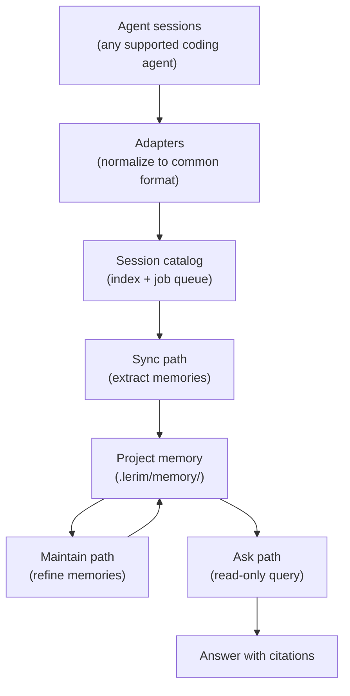
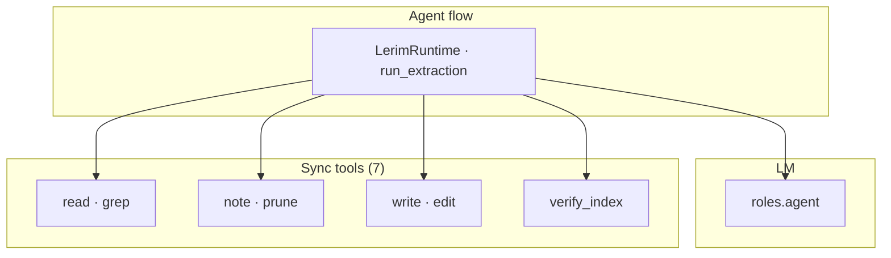
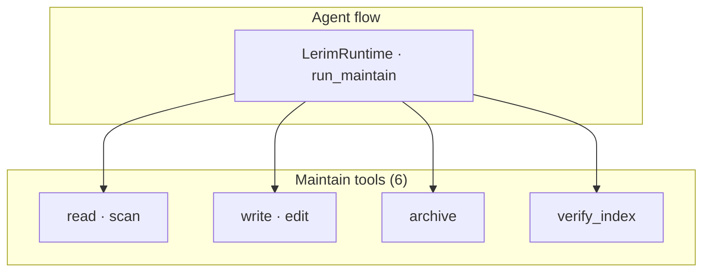

# How It Works

Lerim is the **continual learning layer** for AI coding agents. It watches your agent sessions, extracts decisions and learnings, and makes that knowledge available to every agent on every future session.
The active runtime is **PydanticAI-only** across sync, maintain, and ask.

---

## Core principles

<div class="grid cards" markdown>

-   :material-file-document-outline:{ .lg .middle } **File-first**

    ---

    Memories are plain markdown files with YAML frontmatter. No database required -- files are the canonical store. Humans and agents can read them directly.

-   :material-folder-account:{ .lg .middle } **Project-scoped**

    ---

    Each project gets its own `.lerim/` directory. Memories are isolated per-repo so different projects don't mix.

-   :material-transit-connection-variant:{ .lg .middle } **Agent-agnostic**

    ---

    Works with any coding agent that produces session traces. Platform adapters normalize different formats into a common pipeline.

-   :material-refresh:{ .lg .middle } **Self-maintaining**

    ---

    Memories are automatically refined over time -- duplicates merged, stale entries archived, related learnings consolidated.

</div>

---

## Data flow

Lerim has two write paths that work together: **sync** (hot path) and **maintain** (cold path). Querying uses a separate read-only ask path.



---

## Sync path (hot)

The sync path processes new agent sessions and turns them into memories.

**Agent / tools view** -- `LerimRuntime` runs the **PydanticAI extraction flow** with the **`[roles.agent]`** model. The agent uses memory tool functions (`read`, `grep`, `note`, `prune`, `write`, `edit`, `verify_index`) to inspect trace content and write summaries/memories.



**Pipeline steps** (ingest + agent run):

1. **Discover** -- adapters scan session directories for new sessions within the time window (default: last 7 days)
2. **Index** -- new sessions are cataloged with metadata (agent type, repo path, timestamps)
3. **Compact** -- traces are compacted by stripping tool outputs and reasoning blocks (typically 40-90% size reduction), cached in `~/.lerim/cache/`
4. **Extract** -- the extraction agent reads transcript + existing memories, then writes high-value items as typed markdown (`user`, `feedback`, `project`, `reference`)
5. **Dedupe** -- happens inside the extraction loop via `read`, `grep`, `write`, and `edit`
6. **Summarize** -- `write(type="summary", ...)` stores an episodic summary under `memory/summaries/`
7. **Budget control** -- request-turn budget is bounded by config and auto-scaled for extraction by trace size

---

## Maintain path (cold)

The maintain path refines existing memories offline.

**Agent / tools view** — same **`[roles.agent]`** model; **maintain flow** uses read/write tool functions (no trace ingestion):



**Pipeline steps** (what the maintainer prompt instructs):

1. **Scan** -- `scan()` plus optional reads of `index.md` and `summaries/`
2. **Merge duplicates** -- archive or edit redundant files
3. **Archive low-value** -- `archive()` moves files to `memory/archived/`
4. **Consolidate** -- combine topics via `edit()` / `write()`
5. **Re-index** -- `verify_index()` checks consistency; agent uses `edit("index.md", ...)` when needed

---

## Ask path (read-only)

`lerim ask` runs a PydanticAI query flow using the same `[roles.agent]` model configuration. It uses read-only tools (`scan`, `read`) to gather evidence from memory files and return an answer with filename citations.

---

## Deployment model

Lerim runs as a **single process** (`lerim serve`) that provides the daemon loop and JSON API. Dashboard UI is not released yet. Typically this runs inside a Docker container via `lerim up`, but can also be started directly.

Service commands (`ask`, `sync`, `maintain`, `status`) are thin HTTP clients that forward requests to the server.

```
CLI / clients                       lerim serve (Docker or direct)
-----                               --------
lerim ask "q"   --HTTP POST-->      /api/ask
lerim sync      --HTTP POST-->      /api/sync
lerim maintain  --HTTP POST-->      /api/maintain
lerim status    --HTTP GET--->      /api/status
browser         --HTTP------->      Local API root (stub/diagnostic page)

lerim init        (host only, no server needed)
lerim project add (host only, no server needed)
lerim up/down     (host only, manages Docker)
```

=== "Docker (recommended)"

    ```bash
    pip install lerim
    lerim init
    lerim project add .
    lerim up                    # starts container with daemon + JSON API
    ```

=== "Direct (development)"

    ```bash
    pip install lerim
    lerim init
    lerim connect auto
    lerim serve                 # daemon + JSON API in foreground
    ```

---

## Storage model

### Per-project: `<repo>/.lerim/`

```text
<repo>/.lerim/
├── memory/
│   ├── *.md                     # flat memory files (YAML frontmatter)
│   ├── index.md                 # optional index (maintained by the agent)
│   ├── summaries/               # episodic session summaries (timestamped .md files)
│   └── archived/                # soft-deleted memories
└── workspace/                   # run artifacts (logs, per-run JSON)
```

### Global: `~/.lerim/`

```text
~/.lerim/
├── config.toml                  # user global configuration
├── index/sessions.sqlite3       # session catalog + job queue
├── cache/                       # compacted trace caches per platform
├── activity.log                 # append-only activity log
└── platforms.json               # platform detection cache
```

---

## Next steps

<div class="grid cards" markdown>

-   :material-brain:{ .lg .middle } **Memory Model**

    ---

    Learn about memory types and layout.

    [:octicons-arrow-right-24: Memory model](memory-model.md)

-   :material-robot:{ .lg .middle } **Supported Agents**

    ---

    See which coding agents Lerim can ingest sessions from.

    [:octicons-arrow-right-24: Supported agents](supported-agents.md)

-   :material-sync:{ .lg .middle } **Sync & Maintain**

    ---

    More on the sync and maintain pipelines.

    [:octicons-arrow-right-24: Sync & maintain](sync-maintain.md)

-   :material-cog:{ .lg .middle } **Configuration**

    ---

    TOML config, model roles, intervals, and tracing.

    [:octicons-arrow-right-24: Configuration](../configuration/overview.md)

</div>
