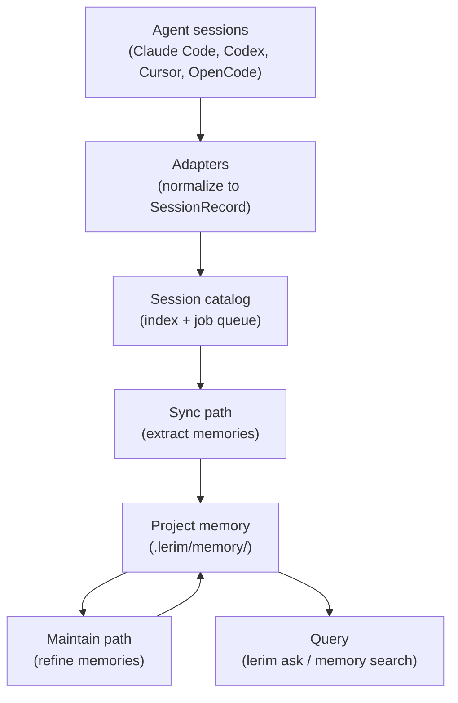
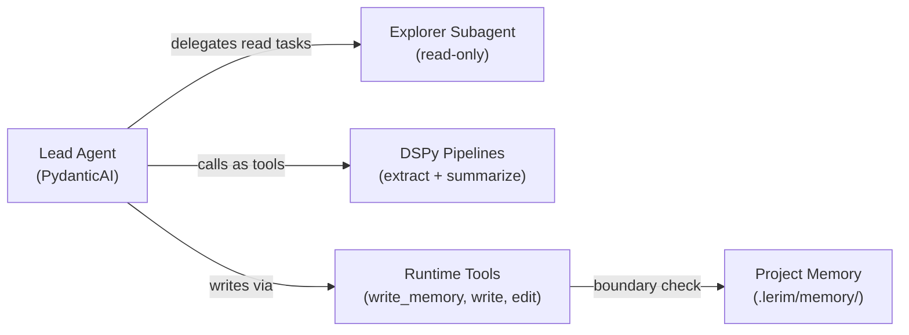

# How It Works

Lerim is a **continual learning layer** for coding agents. It watches your agent sessions, extracts decisions and learnings, and stores them as plain markdown files that any agent can query.

This page explains the architecture, data flow, deployment model, and security boundaries.

---

## Architecture overview

Lerim is built around four core principles:

<div class="grid cards" markdown>

-   :material-file-document-outline:{ .lg .middle } **File-first**

    ---

    Memories are plain markdown files with YAML frontmatter. No database required — files are the canonical store. Humans and agents can read them directly.

-   :material-database-off:{ .lg .middle } **No database required**

    ---

    Default search mode is `files` — scan markdown directly. SQLite is used only for session indexing and job queuing, not for memory storage.

-   :material-folder-account:{ .lg .middle } **Project-scoped by default**

    ---

    Each project gets its own `.lerim/` directory. Memories are isolated per-repo. Global fallback is configured but not yet active.

-   :material-transit-connection-variant:{ .lg .middle } **Agent-agnostic**

    ---

    Works with Claude Code, Codex CLI, Cursor, and OpenCode. Platform adapters normalize different session formats into a common pipeline.

</div>

---

## Data flow

Lerim has two runtime paths that work together: **sync** (hot path) and **maintain** (cold path).



---

## Sync path

The sync path processes new agent sessions: reads transcript archives, extracts decision and learning candidates via DSPy, deduplicates against existing memories, and writes new primitives to the memory folder.


### Steps

1. **Discover sessions** — Platform adapters scan configured session directories for new or changed sessions within the time window (default: last 7 days).
2. **Index** — New sessions are written to the session catalog (`sessions.sqlite3`) with metadata (run ID, agent type, repo path, timestamps, message counts).
3. **Enqueue** — Sessions matching a registered project are enqueued as jobs. Sessions without a project match are indexed but not extracted.
4. **Claim** — The daemon claims pending jobs in chronological order (oldest-first) so later sessions can correctly update memories created by earlier ones.
5. **Read transcript** — The raw session trace file (JSONL or exported JSONL) is read from disk. Lerim does not copy traces — it reads directly from the source.
6. **Extract candidates (DSPy)** — The transcript is split into overlapping windows (configurable via `max_window_tokens` and `window_overlap_tokens`). Each window is processed by `dspy.ChainOfThought` with `MemoryExtractSignature`. Multi-window results are merged and deduplicated by a second `MemoryMergeSignature` call.
7. **Deduplicate** — The lead agent compares extracted candidates against existing memories using read-only tools. It decides `add`, `update`, or `no-op` for each candidate.
8. **Write memories** — New memories are written via the `write_memory` tool (structured fields → markdown). Updated memories are edited in place. All writes are boundary-checked.
9. **Write summary** — An episodic summary of the session is generated via the summarization pipeline and written to `memory/summaries/YYYYMMDD/HHMMSS/{slug}.md`.
10. **Record artifacts** — Run evidence (`extract.json`, `summary.json`, `memory_actions.json`, logs) is stored in the workspace folder.

---

## Maintain path

The maintain path runs offline refinement over stored memories: merges duplicates, archives low-value entries, consolidates related memories, and applies time-based decay.


### Steps

1. **Scan** — The maintain agent reads all active memories in the project's `memory/` directory using read-only tools.
2. **Merge duplicates** — Identifies memories covering the same concept and merges them into a single, stronger entry.
3. **Archive low-value** — Memories with effective confidence below the archive threshold (default: 0.2) are soft-deleted to `memory/archived/`.
4. **Consolidate** — Related memories that complement each other are combined into consolidated entries.
5. **Apply decay** — Time-based confidence decay is applied. Memories not accessed within the decay period (default: 180 days) lose effective confidence, with a floor of 0.1.
6. **Report** — Maintain actions (`merged`, `archived`, `consolidated`, `decayed`) are recorded in `maintain_actions.json` and the activity log.

!!! info "Project iteration"
    Maintain runs independently for each registered project. It iterates over all entries in `config.projects`, creating a separate agent instance per project's memory root.

---

## Agent orchestration

Lerim uses a two-agent architecture powered by PydanticAI, with DSPy pipelines called as tools.



### Lead agent

The lead agent (PydanticAI) orchestrates all flows — sync, maintain, and chat. It is the **only component allowed to write** memory files.

| Capability | Tools |
|------------|-------|
| Read | `read`, `glob`, `grep` |
| Write | `write`, `write_memory`, `edit` |
| Extraction | `extract_pipeline`, `summarize_pipeline` |
| Delegation | `explore` (invokes explorer subagent) |

### Explorer subagent

A read-only agent delegated from the lead for candidate gathering and memory search:

- **Tools**: `read`, `glob`, `grep` only
- **Cannot write** — no write or edit tools are registered

### DSPy pipelines

Called as tools from the lead agent:

| Pipeline | Signature | Purpose |
|----------|-----------|---------|
| Extraction | `MemoryExtractSignature` | Transcript → windowed ChainOfThought → per-window candidates → merge → structured memory candidates |
| Summarization | `TraceSummarySignature` | Transcript → windowed ChainOfThought → partial summaries → merge → structured summary with frontmatter |

Both use `dspy.ChainOfThought` with transcript windowing. Large transcripts are split into overlapping windows, processed independently, then merged in a final ChainOfThought call.

---

## Deployment model

Lerim runs as a **single process** (`lerim serve`) that provides the daemon loop, HTTP API, and dashboard. Typically this runs inside a Docker container via `lerim up`, but can also be started directly for development.

Service commands (`ask`, `sync`, `maintain`, `status`) are thin HTTP clients that forward requests to the server.

```
CLI / clients                       lerim serve (Docker or direct)
─────────────                       ──────────────────────────────
lerim ask "q"   ──HTTP POST──►     /api/ask
lerim sync      ──HTTP POST──►     /api/sync
lerim maintain  ──HTTP POST──►     /api/maintain
lerim status    ──HTTP GET───►     /api/status
skills (curl)   ──HTTP───────►     /api/*
browser         ──HTTP───────►     dashboard UI (port 8765)

lerim init        (host only, no server needed)
lerim project add (host only, no server needed)
lerim up/down     (host only, manages Docker)
```

=== "Docker (recommended)"

    ```bash
    pip install lerim
    lerim init
    lerim project add .
    lerim up                    # starts container with daemon + API + dashboard
    ```

=== "Direct (development)"

    ```bash
    pip install lerim
    lerim init
    lerim connect auto
    lerim serve                 # starts daemon + API + dashboard in foreground
    ```

---

## Storage model

### Per-project: `<repo>/.lerim/`

Each registered project stores its own memories and run artifacts:

```text
<repo>/.lerim/
├── config.toml                          # project overrides
├── memory/
│   ├── decisions/
│   │   └── <slug>.md                    # decision memory files
│   ├── learnings/
│   │   └── <slug>.md                    # learning memory files
│   ├── summaries/
│   │   └── YYYYMMDD/
│   │       └── HHMMSS/
│   │           └── <slug>.md            # session summaries
│   └── archived/
│       ├── decisions/
│       │   └── <slug>.md                # soft-deleted decisions
│       └── learnings/
│           └── <slug>.md                # soft-deleted learnings
├── workspace/
│   ├── sync-<YYYYMMDD-HHMMSS>-<shortid>/
│   │   ├── extract.json                 # extraction results
│   │   ├── summary.json                 # summarization results
│   │   ├── memory_actions.json          # add/update/no-op decisions
│   │   ├── agent.log                    # lead agent log
│   │   ├── subagents.log               # explorer subagent log
│   │   └── session.log                  # session processing log
│   └── maintain-<YYYYMMDD-HHMMSS>-<shortid>/
│       ├── maintain_actions.json        # merge/archive/consolidate actions
│       ├── agent.log                    # lead agent log
│       └── subagents.log               # explorer subagent log
├── meta/
│   └── traces/
│       └── sessions/                    # reserved
└── index/
    └── memories.sqlite3                 # memory access tracker (decay/archiving)
```

### Global: `~/.lerim/`

Shared across all projects:

```text
~/.lerim/
├── config.toml                          # user global configuration
├── index/
│   └── sessions.sqlite3                 # session catalog, FTS index, job queue, service run log
├── cache/                               # session trace caches per platform
│   ├── claude/
│   ├── codex/
│   ├── cursor/
│   └── opencode/
├── activity.log                         # append-only activity log
├── docker-compose.yml                   # generated by lerim up
└── platforms.json                       # platform detection cache
```

---

## Scope resolution

Config precedence (low to high priority):

| Priority | Source | Description |
|----------|--------|-------------|
| 1 (lowest) | `src/lerim/config/default.toml` | Shipped with the package — all defaults |
| 2 | `~/.lerim/config.toml` | User global overrides |
| 3 | `<repo>/.lerim/config.toml` | Project-specific overrides |
| 4 (highest) | `LERIM_CONFIG` env var | Explicit path override (for CI/tests) |

API keys come from environment variables only: `MINIMAX_API_KEY`, `ZAI_API_KEY`, `OPENROUTER_API_KEY`, `OPENAI_API_KEY`, optional `ANTHROPIC_API_KEY`.

---

## Security boundaries

Lerim enforces strict write boundaries to prevent accidental data corruption:

| Boundary | Enforcement |
|----------|-------------|
| **Write boundary** | Runtime tools deny `write` and `edit` outside `memory_root` and workspace roots |
| **`write_memory` tool** | Memory files (decisions/learnings) can only be created via `write_memory`, which accepts structured fields and builds markdown in Python — the LLM never assembles frontmatter directly |
| **`write` rejection** | The `write` tool rejects memory primitive paths with `ModelRetry`, directing the LLM to use `write_memory` instead |
| **No shell** | All file operations use Python tools — no shell or subprocess calls |
| **Read-only subagent** | Explorer subagent has `read`, `glob`, `grep` only — no write capability |
| **Localhost-only API** | HTTP API binds to `127.0.0.1` by default — no auth needed because it is not network-exposed |

!!! warning "Write boundary"
    The lead agent is the only component allowed to persist or delete memory records. All writes are boundary-checked at the tool level to ensure they stay inside `memory_root` and the current run's workspace folder.

---

## Next steps

<div class="grid cards" markdown>

-   :material-brain:{ .lg .middle } **Memory Model**

    ---

    Learn about primitives, frontmatter, lifecycle, and decay.

    [:octicons-arrow-right-24: Memory model](memory-model.md)

-   :material-robot:{ .lg .middle } **Supported Agents**

    ---

    See which coding agents Lerim can ingest sessions from.

    [:octicons-arrow-right-24: Supported agents](supported-agents.md)

-   :material-sync:{ .lg .middle } **Sync & Maintain**

    ---

    Deep dive into the sync and maintain pipelines.

    [:octicons-arrow-right-24: Sync & maintain](sync-maintain.md)

-   :material-cog:{ .lg .middle } **Configuration**

    ---

    TOML config, model roles, intervals, and tracing.

    [:octicons-arrow-right-24: Configuration](../configuration/overview.md)

</div>
