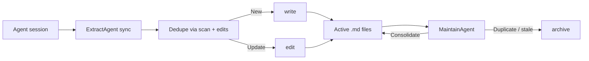

# Memory Model

Lerim stores memories as plain markdown files with YAML frontmatter. No database required -- files are the canonical store. Both humans and agents can read and edit them directly.

---

## Types

Each memory file uses a `type` field in frontmatter:

| Type | Purpose |
|------|---------|
| `user` | Preferences, role, and working style (about the person) |
| `feedback` | Corrections and confirmations from the user |
| `project` | Decisions and context not obvious from code alone |
| `reference` | Pointers to external systems (dashboards, tickets, docs) |

Episodic **session summaries** live under `memory/summaries/` (written by `write(type="summary", ...)` during sync). They complement durable memories but are not the same format.

---

## Directory layout

Each project stores memories under `.lerim/memory/`:

```text
<repo>/.lerim/memory/
├── *.md                         # flat memory files (one file per memory)
├── index.md                     # optional index (updated by the agent)
├── summaries/YYYYMMDD/HHMMSS/   # episodic session summaries
└── archived/                    # soft-deleted memories (from archive)
```

---

## Memory lifecycle



1. **Sync** -- the lead agent reads the trace and writes or edits markdown memories.
2. **Maintain** -- a separate pass merges duplicates, archives noise, and refreshes `index.md`.

---

## Roadmap (not implemented yet)

Time-based **confidence decay**, automatic **graph linking** between memories, and vector search are **not** in the current open-source runtime. Configuration keys for those may appear commented in `default.toml` as placeholders.

---

## Reset

Memory reset is explicit and destructive:

```bash
lerim memory reset --scope both --yes     # wipe everything
lerim memory reset --scope project --yes  # project data only
lerim memory reset --scope global --yes   # global data only
```

!!! warning "Sessions DB scope"
    The sessions DB lives in global `index/sessions.sqlite3`, so `--scope project` alone does **not** reset the session queue. Use `--scope global` or `--scope both` to fully reset indexing state.

---

## Next steps

<div class="grid cards" markdown>

-   :material-sync:{ .lg .middle } **Sync & Maintain**

    ---

    How the two pipelines run.

    [:octicons-arrow-right-24: Sync & maintain](sync-maintain.md)

-   :material-cog:{ .lg .middle } **Configuration**

    ---

    TOML config and model roles.

    [:octicons-arrow-right-24: Configuration](../configuration/overview.md)

</div>
