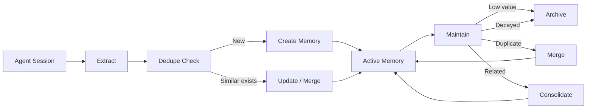

# Memory Model

Lerim stores memories as plain markdown files with YAML frontmatter. No database required -- files are the canonical store. Both humans and agents can read and edit them directly.

---

## Primitives

Lerim uses two core memory types plus episodic summaries:

| Primitive | Purpose | Example |
|-----------|---------|---------|
| **Decision** | An architectural or design choice made during development | "Use JWT bearer tokens for API auth" |
| **Learning** | A reusable insight, procedure, friction point, or preference | "pytest fixtures must be in conftest.py for discovery" |
| **Summary** | An episodic record of what happened in a coding session | "Refactored auth module, added rate limiting" |

Decisions and learnings are the durable primitives -- they persist and are refined over time. Summaries are episodic records written once per session and not modified by the maintain path.

---

## Learning kinds

Learnings are categorized by kind:

| Kind | Description | Example |
|------|-------------|---------|
| `insight` | A general observation or understanding | "FastAPI dependency injection resolves at request time" |
| `procedure` | A step-by-step process or workflow | "To add a new adapter: create module, implement protocol, register" |
| `friction` | Something that caused difficulty or slowdown | "Edit tool fails when target string appears in multiple files" |
| `pitfall` | A mistake or trap to avoid | "Never run migrations on production without a backup" |
| `preference` | A stylistic or tooling preference | "Always use pathlib over os.path" |

---

## Directory layout

Each project stores memories in its `.lerim/` directory:

```text
<repo>/.lerim/memory/
├── decisions/*.md               # decision memory files
├── learnings/*.md               # learning memory files
├── summaries/YYYYMMDD/HHMMSS/   # session summaries
└── archived/                    # soft-deleted memories
    ├── decisions/*.md
    └── learnings/*.md
```

---

## Memory lifecycle



1. **Extract** -- DSPy finds decision and learning candidates from session transcripts
2. **Dedupe** -- the lead agent compares candidates against existing memories
3. **Create / Update** -- new memories are written as markdown; updates modify existing files
4. **Maintain** -- periodic refinement merges duplicates, consolidates related memories, archives low-value entries, and applies time-based decay

---

## Confidence and decay

Each memory has a `confidence` score (0.0 to 1.0) assigned during extraction. Over time, memories that are not accessed lose effective confidence through decay.

| Parameter | Default | Description |
|-----------|---------|-------------|
| `decay_days` | `180` | Days of no access before full decay |
| `min_confidence_floor` | `0.1` | Decay never drops below this value |
| `archive_threshold` | `0.2` | Effective confidence below this triggers archiving |
| `recent_access_grace_days` | `30` | Recently accessed memories skip archiving |

- Querying memories (`lerim ask`, `lerim memory search`) resets the access timestamp
- Frequently useful memories naturally stay alive; unused ones fade and are eventually archived

```toml
[memory.decay]
enabled = true
decay_days = 180
min_confidence_floor = 0.1
archive_threshold = 0.2
recent_access_grace_days = 30
```

---

## Reset

Memory reset is explicit and destructive:

```bash
lerim memory reset --scope both --yes     # wipe everything
lerim memory reset --scope project --yes  # project data only
lerim memory reset --scope global --yes   # global data only
```

!!! warning "Sessions DB scope"
    The sessions DB lives in global `index/sessions.sqlite3`, so `--scope project` alone does **not** reset the session queue. Use `--scope global` or `--scope both` to fully reset indexing state.

---

## Next steps

<div class="grid cards" markdown>

-   :material-cog:{ .lg .middle } **How It Works**

    ---

    Architecture overview, data flow, and deployment model.

    [:octicons-arrow-right-24: How it works](how-it-works.md)

-   :material-sync:{ .lg .middle } **Sync & Maintain**

    ---

    How sessions become memories and how memories stay clean.

    [:octicons-arrow-right-24: Sync & maintain](sync-maintain.md)

-   :material-tune:{ .lg .middle } **Configuration**

    ---

    Decay settings, model roles, and scope options.

    [:octicons-arrow-right-24: Configuration](../configuration/overview.md)

</div>
