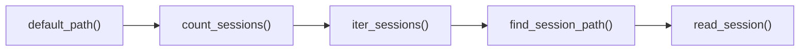
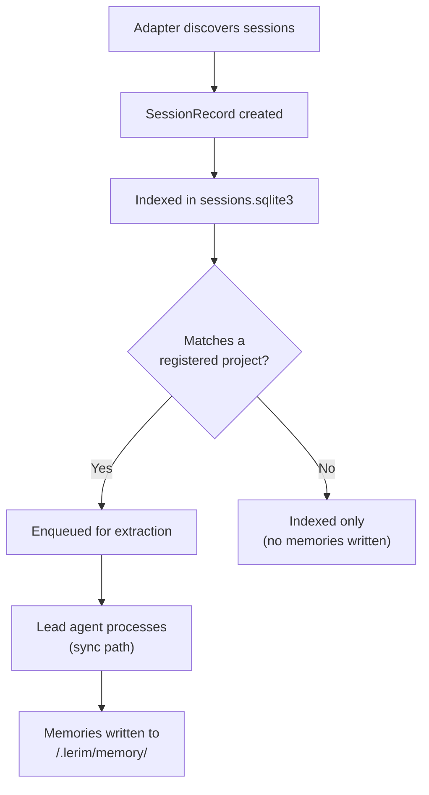

# Supported Agents

Lerim works with any coding agent that produces session traces. Each agent stores sessions in a different format and location — Lerim's adapter system normalizes them all into a common pipeline. Adding support for a new agent is straightforward via the adapter protocol.

---

## Current adapters

| Agent | Session format | Default session path | Notes |
|-------|---------------|---------------------|-------|
| **Claude Code** | JSONL files | `~/.claude/projects/` | Direct JSONL read |
| **Codex CLI** | JSONL files | `~/.codex/sessions/` | Direct JSONL read |
| **Cursor** | SQLite → JSONL | `~/Library/Application Support/Cursor/User/globalStorage/` (macOS) | SQLite `state.vscdb` exported to JSONL cache |
| **OpenCode** | SQLite → JSONL | `~/.local/share/opencode/` | SQLite `opencode.db` exported to JSONL cache |

Claude Code and Codex CLI store sessions as JSONL files that Lerim reads directly. Cursor and OpenCode use SQLite databases — Lerim exports their data to a JSONL cache for uniform processing.

More adapters are added over time. Any coding agent that produces session traces can be supported — see below for how to add one.

---

## How adapters work

Each adapter implements a 5-step protocol defined in `src/lerim/adapters/base.py`:



### Protocol methods

| Step | Method | Purpose |
|------|--------|---------|
| 1 | `default_path()` | Returns the default traces directory for this platform on the current OS |
| 2 | `count_sessions(path)` | Counts how many sessions exist under the given path |
| 3 | `iter_sessions(traces_dir, start, end, known_run_hashes)` | Yields `SessionRecord` entries within a time window, skipping already-known sessions by hash |
| 4 | `find_session_path(session_id, traces_dir)` | Locates a specific session file on disk by session ID |
| 5 | `read_session(session_path, session_id)` | Parses one session file and returns a normalized `ViewerSession` for session viewers (e.g. Cloud) |

Adapters handle platform-specific formats (JSONL, SQLite) and normalize them into a common `SessionRecord` that the sync pipeline processes. The `SessionRecord` contains:

- `run_id` — unique session identifier
- `agent_type` — platform name (`claude`, `codex`, `cursor`, `opencode`)
- `session_path` — absolute path to the session file on disk
- `repo_path` — which project directory the session was working in
- `start_time` — when the session started
- `message_count`, `tool_call_count`, `error_count`, `total_tokens` — session metrics
- `content_hash` — for change detection (skip re-indexing unchanged sessions)

---

## Auto-detection

Connect all supported platforms in one command:

```bash
lerim connect auto
```

This scans default paths for each platform and registers any that are found on disk. The results are saved to `~/.lerim/platforms.json`.

---

## Connect individual platforms

```bash
lerim connect claude
lerim connect codex
lerim connect cursor
lerim connect opencode
```

## List connections

```bash
lerim connect list
```

## Disconnect a platform

```bash
lerim connect remove claude
```

---

## Custom session paths

If your agent stores sessions in a non-default location, use `--path` to override:

```bash
lerim connect claude --path /custom/path/to/claude/sessions
lerim connect cursor --path ~/my-cursor-data/globalStorage
```

The path is expanded (`~` is resolved) and must exist on disk. This overrides the auto-detected default for that platform.

=== "Default paths"

    ```bash
    # Claude Code
    ~/.claude/projects/

    # Codex CLI
    ~/.codex/sessions/

    # Cursor (macOS)
    ~/Library/Application Support/Cursor/User/globalStorage/

    # OpenCode
    ~/.local/share/opencode/
    ```

=== "Custom paths"

    ```bash
    lerim connect claude --path ~/custom/claude-sessions
    lerim connect codex --path /mnt/data/codex
    lerim connect cursor --path ~/AppData/cursor
    lerim connect opencode --path ~/custom/opencode-data
    ```

---

## How sessions flow through the pipeline



!!! info "Project matching"
    Sessions are routed to projects based on the session's `repo_path` field. If a session's working directory matches a registered project path, its memories are written to that project's `.lerim/memory/` directory. Sessions that don't match any project are indexed but not extracted.

---

!!! tip "PRs welcome"
    Want support for another coding agent? Adding an adapter is the easiest contribution path -- clear interface, isolated scope. Adapters live in `src/lerim/adapters/`. Start by reading an existing one (e.g., `codex.py` or `claude.py`) as a reference, then implement the 5-method protocol. See the [Contributing guide](../contributing/getting-started.md) for setup instructions.

---

## Next steps

<div class="grid cards" markdown>

-   :material-cog:{ .lg .middle } **How It Works**

    ---

    Architecture overview, data flow, and deployment model.

    [:octicons-arrow-right-24: How it works](how-it-works.md)

-   :material-brain:{ .lg .middle } **Memory Model**

    ---

    Primitives, frontmatter, lifecycle, and decay.

    [:octicons-arrow-right-24: Memory model](memory-model.md)

-   :material-sync:{ .lg .middle } **Sync & Maintain**

    ---

    How sessions become memories and how memories stay clean.

    [:octicons-arrow-right-24: Sync & maintain](sync-maintain.md)

-   :material-book-open-variant:{ .lg .middle } **Contributing**

    ---

    How to add a new adapter or contribute to Lerim.

    [:octicons-arrow-right-24: Contributing](../contributing/getting-started.md)

</div>
