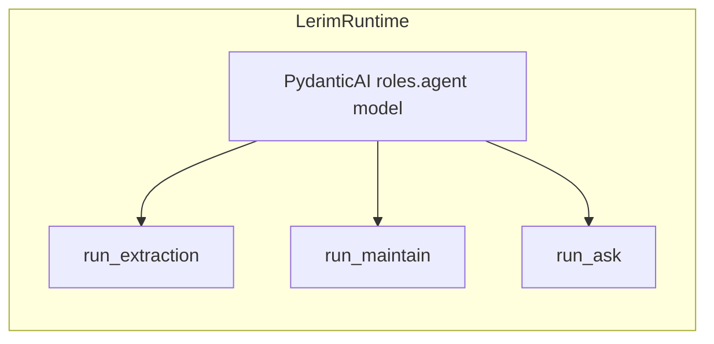

# Model Roles

Lerim runtime uses one model role: **`[roles.agent]`**.
That role powers all three PydanticAI flows: sync extraction, maintain, and ask.

## Runtime roles

| Role | Used by | Purpose |
|------|---------|---------|
| `agent` | `LerimRuntime` | Shared model for `run_extraction`, `run_maintain`, and `run_ask`. |

## Architecture



## Role configuration

Configure the role under `[roles.agent]` in your TOML config:

```toml
[roles.agent]
provider = "minimax"
model = "MiniMax-M2.7"
api_base = ""
fallback_models = []
max_iters_maintain = 50
max_iters_ask = 20
openrouter_provider_order = []
thinking = true
temperature = 1.0
top_p = 0.95
top_k = 40
max_tokens = 32000
parallel_tool_calls = true
```

`max_iters_maintain` and `max_iters_ask` are request-turn budgets for those flows.
Sync extraction request budget is auto-scaled from trace size and does not use a static `max_iters_sync` field.

## Provider support

Supported providers: `minimax`, `opencode_go`, `zai`, `openai`, `openrouter`, `ollama`, `mlx`.

### MiniMax (default)

```toml
[roles.agent]
provider = "minimax"
model = "MiniMax-M2.7"
```

Requires `MINIMAX_API_KEY`.

### OpenAI

```toml
[roles.agent]
provider = "openai"
model = "gpt-5"
```

Requires `OPENAI_API_KEY`.

### OpenCode Go

```toml
[roles.agent]
provider = "opencode_go"
model = "minimax-m2.5"
```

Requires `OPENCODE_API_KEY`.

### Ollama (local)

```toml
[roles.agent]
provider = "ollama"
model = "qwen3:32b"
api_base = "http://127.0.0.1:11434"
```

No API key required.

## Common options

| Option | Description |
|--------|-------------|
| `provider` | Backend provider |
| `model` | Model identifier |
| `api_base` | Optional custom API endpoint |
| `fallback_models` | Optional fallback chain on quota/rate-limit errors (default disabled) |
| `thinking` | Enable reasoning mode when supported |
| `temperature` | Sampling temperature |
| `top_p` | Nucleus sampling control |
| `top_k` | Top-k sampling control |
| `max_tokens` | Maximum output tokens |
| `parallel_tool_calls` | Enable parallel tool calls when supported |
| `max_iters_maintain` | Maintain request-turn budget |
| `max_iters_ask` | Ask request-turn budget |
| `openrouter_provider_order` | Preferred OpenRouter provider ordering |

## Fallback models

When configured (non-empty list), runtime falls through `fallback_models` in order on quota/rate-limit errors.
Shipped default is `[]`, so fallback is disabled unless you opt in.
Each fallback entry can be either `provider:model` or just `model` (which defaults to `openrouter`).

## API key resolution

| Provider | Environment variable |
|----------|---------------------|
| `minimax` | `MINIMAX_API_KEY` |
| `zai` | `ZAI_API_KEY` |
| `openrouter` | `OPENROUTER_API_KEY` |
| `openai` | `OPENAI_API_KEY` |
| `opencode_go` | `OPENCODE_API_KEY` |
| `ollama` | *(none required)* |
| `mlx` | *(none required)* |

!!! warning "Missing keys"
	If the API key for the primary provider is missing, Lerim fails at runtime model construction.
