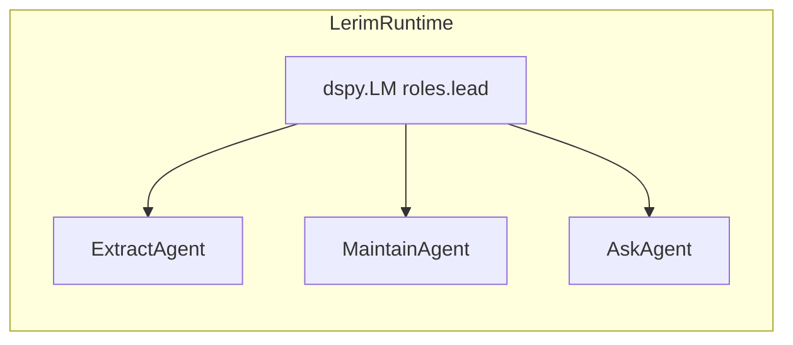

# Model Roles

Lerim's runtime uses a **single DSPy language model** for orchestration: **`[roles.lead]`** powers `ExtractAgent` (sync), `MaintainAgent`, and `AskAgent` via `dspy.context(lm=...)`.

A separate **`[roles.extract]`** block is loaded into `Config` (API, future windowing, observability). It does **not** replace the lead LM during ReAct today.

A **`[roles.codex]`** block may be parsed for Lerim Cloud; it is **not** consumed by `LerimRuntime` for local sync/maintain/ask.

## Runtime roles

| Role | Used by | Purpose |
|------|---------|---------|
| `lead` | `LerimRuntime` | **Only** LLM for DSPy ReAct: sync, maintain, ask. Tools are plain Python functions in `lerim.agents.tools` (`write_memory`, `read_file`, `scan_memory_manifest`, …). |
| `extract` | Config / HTTP API | Windowing and provider metadata; not a second ReAct LM. |

## Architecture



## Role configuration

Each role is configured under `[roles.<name>]` in your TOML config.

=== "Lead"

	```toml
	[roles.lead]
	provider = "opencode_go"
	model = "minimax-m2.5"
	api_base = ""
	fallback_models = ["minimax:MiniMax-M2.5"]
	timeout_seconds = 600
	max_iterations = 30
	max_iters_sync = 50
	max_iters_maintain = 100
	max_iters_ask = 30
	openrouter_provider_order = []
	thinking = true
	max_tokens = 32000
	```

	The lead model is the only component that runs **DSPy ReAct** for user-facing flows. It calls tools defined in `lerim.agents.tools` through `dspy.ReAct`.

=== "Extract"

	```toml
	[roles.extract]
	provider = "opencode_go"
	model = "minimax-m2.5"
	api_base = ""
	fallback_models = []
	timeout_seconds = 300
	max_window_tokens = 100000
	window_overlap_tokens = 5000
	openrouter_provider_order = []
	thinking = true
	max_tokens = 32000
	max_workers = 4
	```

	Used for configuration and API responses. Sync still uses **`lead`** for `ExtractAgent`.

=== "Codex (config)"

	```toml
	[roles.codex]
	provider = "opencode_go"
	model = "minimax-m2.5"
	api_base = ""
	timeout_seconds = 600
	idle_timeout_seconds = 120
	```

	This block is loaded for config visibility (e.g. Cloud) and future use. **Changing it does not affect the DSPy ReAct lead runtime.**

## Provider support

Providers are configured via `provider` + `[providers]` default URLs. See [config.toml](config-toml.md).

## Switching providers

You can point the **lead** role at any supported backend:

### Use OpenAI directly

```toml
[roles.lead]
provider = "openai"
model = "gpt-5"
```

Requires `OPENAI_API_KEY` in your environment.

### Use OpenCode Go (default)

```toml
[roles.lead]
provider = "opencode_go"
model = "minimax-m2.5"
```

Requires `OPENCODE_API_KEY` (or your provider's env var as documented for that backend).

### Use Ollama (local models)

```toml
[roles.lead]
provider = "ollama"
model = "qwen3:32b"
api_base = "http://127.0.0.1:11434"
```

No API key required. `auto_unload` in `[providers]` frees RAM between cycles.

## Common options

| Option | Description |
|--------|-------------|
| `provider` | Backend: `opencode_go`, `minimax`, `zai`, `openrouter`, `openai`, `ollama`, `mlx`, … |
| `model` | Model identifier (OpenRouter: full slug) |
| `api_base` | Custom API endpoint |
| `fallback_models` | Ordered fallback chain on quota errors |
| `timeout_seconds` | HTTP timeout |
| `thinking` | Enable reasoning mode when supported |

**Lead-only:** `max_iters_sync`, `max_iters_maintain`, `max_iters_ask` cap ReAct iterations per flow.

## Fallback models

When the primary model returns a quota error, `LerimRuntime` retries with each `fallback_models` entry:

```toml
[roles.lead]
provider = "opencode_go"
model = "minimax-m2.5"
fallback_models = ["minimax:MiniMax-M2.5", "zai:glm-4.7"]
```

## API key resolution

| Provider | Environment variable |
|----------|---------------------|
| `minimax` | `MINIMAX_API_KEY` |
| `zai` | `ZAI_API_KEY` |
| `openrouter` | `OPENROUTER_API_KEY` |
| `openai` | `OPENAI_API_KEY` |
| `opencode_go` | `OPENCODE_API_KEY` |
| `ollama` | *(none required)* |
| `mlx` | *(none required)* |

!!! warning "Missing keys"
	If the required API key for a role's provider is not set, Lerim raises an error at startup.
