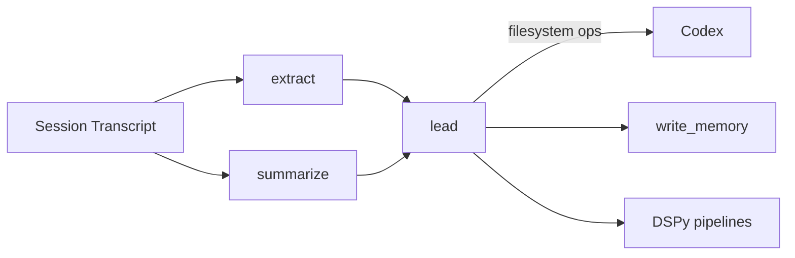

# Model Roles

Lerim uses three model roles to separate concerns across the pipeline. Each role
can point to a different provider and model, letting you balance cost, speed,
and quality.

## The three roles

| Role | Runtime | Purpose | Default model |
|------|---------|---------|---------------|
| `lead` | OpenAI Agents SDK | Orchestrates sync/maintain/ask flows, delegates to Codex, runs decision policy, writes memory | `MiniMax-M2.5` |
| `extract` | DSPy | Extracts decision and learning candidates from session transcripts via ChainOfThought | `MiniMax-M2.5` |
| `summarize` | DSPy | Generates structured session summaries from transcripts via ChainOfThought | `MiniMax-M2.5` |



## Role configuration

Each role is configured under `[roles.<name>]` in your TOML config.

=== "Lead"

	```toml
	[roles.lead]
	provider = "minimax"
	model = "MiniMax-M2.5"
	api_base = ""
	fallback_models = ["zai:glm-4.7"]
	timeout_seconds = 300
	max_iterations = 10
	openrouter_provider_order = []
	thinking = true
	```

	The lead agent is the only component allowed to write memory files. It
	orchestrates the full sync, maintain, and ask flows. Uses `LitellmModel`
	via the OpenAI Agents SDK to support non-OpenAI providers.

=== "Extract"

	```toml
	[roles.extract]
	provider = "minimax"
	model = "MiniMax-M2.5"
	api_base = ""
	fallback_models = ["zai:glm-4.5-air"]
	timeout_seconds = 180
	max_window_tokens = 300000
	window_overlap_tokens = 5000
	openrouter_provider_order = []
	thinking = true
	max_workers = 4
	```

	Extraction runs through `dspy.ChainOfThought` with transcript windowing.
	Large transcripts are split into overlapping windows of `max_window_tokens`,
	processed independently, then merged in a final call.

=== "Summarize"

	```toml
	[roles.summarize]
	provider = "minimax"
	model = "MiniMax-M2.5"
	api_base = ""
	fallback_models = ["zai:glm-4.5-air"]
	timeout_seconds = 180
	max_window_tokens = 300000
	window_overlap_tokens = 5000
	openrouter_provider_order = []
	thinking = true
	max_workers = 4
	```

	Summarization uses the same windowed ChainOfThought approach as extraction,
	producing structured summaries with frontmatter.

## Non-OpenAI providers and ResponsesProxy

The OpenAI Agents SDK natively uses the OpenAI Responses API. To support
non-OpenAI providers (MiniMax, Z.AI, Ollama, etc.), Lerim uses a
`ResponsesProxy` that translates Responses API calls into standard Chat
Completions API calls via LiteLLM. This is transparent -- you configure
providers the same way as before.

## Switching providers

You can point any role at a different provider by changing `provider` and `model`.

### Use OpenAI directly

```toml
[roles.lead]
provider = "openai"
model = "gpt-5"
```

Requires `OPENAI_API_KEY` in your environment.

### Use Z.AI (Coding Plan)

```toml
[roles.lead]
provider = "zai"
model = "glm-4.7"
```

Requires `ZAI_API_KEY` in your environment.

### Use Anthropic via OpenRouter

```toml
[roles.lead]
provider = "openrouter"
model = "anthropic/claude-sonnet-4-20250514"
```

Requires `OPENROUTER_API_KEY` in your environment. OpenRouter proxies the
request to Anthropic.

### Use Ollama (local models)

```toml
[roles.extract]
provider = "ollama"
model = "qwen3:32b"
api_base = "http://127.0.0.1:11434"
```

No API key required. Make sure Ollama is running locally (`ollama serve` or the
macOS background service). Lerim automatically loads models into RAM before each
sync/maintain cycle and unloads them immediately after, so the model only uses
memory during active processing. Disable this with `auto_unload = false` in
`[providers]`.

Override the `api_base` per-role or set the default in `[providers]`:

```toml
[providers]
ollama = "http://127.0.0.1:11434"
auto_unload = true   # free model RAM between cycles (default)
```

If Lerim runs in Docker and Ollama on the host, use `host.docker.internal`:

```toml
[providers]
ollama = "http://host.docker.internal:11434"
```

### Use vllm-mlx (Apple Silicon local models)

```toml
[roles.extract]
provider = "mlx"
model = "mlx-community/Qwen3.5-4B-Instruct-4bit"
```

No API key required. Requires [vllm-mlx](https://github.com/vllm-project/vllm-mlx)
running locally (`pip install vllm-mlx`). Start the server with:

```bash
vllm-mlx serve mlx-community/Qwen3.5-4B-Instruct-4bit --port 8000
```

Override the default base URL per-role or in `[providers]`:

```toml
[providers]
mlx = "http://127.0.0.1:8000/v1"
```

!!! tip "Cost optimization"
	Use a cheaper/faster model for `extract` and `summarize` (high-volume DSPy
	tasks) and a more capable model for `lead` (orchestration and reasoning).

## Common options

All roles share these configuration keys:

| Option | Description |
|--------|-------------|
| `provider` | Backend: `minimax`, `zai`, `openrouter`, `openai`, `ollama`, `mlx` |
| `model` | Model identifier (for OpenRouter, use the full slug e.g. `anthropic/claude-sonnet-4-5-20250929`) |
| `api_base` | Custom API endpoint. Empty = use default from `[providers]` |
| `fallback_models` | Ordered fallback chain: `"model"` (same provider) or `"provider:model"` |
| `timeout_seconds` | HTTP request timeout in seconds |
| `thinking` | Enable model reasoning (default: `true`, set `false` for non-reasoning models) |

**Orchestration role** (`lead`) also has: `max_iterations`.

**DSPy roles** (`extract`, `summarize`) also have: `max_window_tokens`, `window_overlap_tokens`, `max_workers` (default: 4, set 1 for local models).

## Fallback models

When a primary model fails, Lerim tries each fallback in order:

```toml
[roles.extract]
provider = "minimax"
model = "MiniMax-M2.5"
fallback_models = ["zai:glm-4.5-air", "openai:gpt-4.1-mini"]
```

- `"model-slug"` -- uses the same provider as the role
- `"provider:model-slug"` -- uses a different provider (requires that provider's API key)

## API key resolution

| Provider | Environment variable |
|----------|---------------------|
| `minimax` | `MINIMAX_API_KEY` |
| `zai` | `ZAI_API_KEY` |
| `openrouter` | `OPENROUTER_API_KEY` |
| `openai` | `OPENAI_API_KEY` |
| `ollama` | *(none required)* |
| `mlx` | *(none required)* |

!!! warning "Missing keys"
	If the required API key for a role's provider is not set, Lerim raises an
	error at startup. There is no silent fallback.
