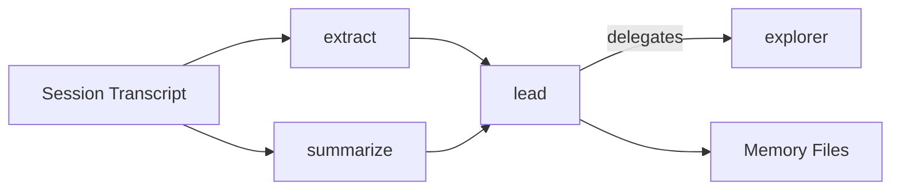

# Model Roles

Lerim uses four model roles to separate concerns across the pipeline. Each role
can point to a different provider and model, letting you balance cost, speed,
and quality.

## The four roles

| Role | Runtime | Purpose | Default model |
|------|---------|---------|---------------|
| `lead` | PydanticAI | Orchestrates sync/maintain/ask flows, delegates to explorer, runs decision policy, writes memory | `MiniMax-M2.5` |
| `explorer` | PydanticAI | Read-only subagent for candidate gathering (glob, grep, read) | `MiniMax-M2.5` |
| `extract` | DSPy | Extracts decision and learning candidates from session transcripts via ChainOfThought | `MiniMax-M2.5` |
| `summarize` | DSPy | Generates structured session summaries from transcripts via ChainOfThought | `MiniMax-M2.5` |



## Role configuration

Each role is configured under `[roles.<name>]` in your TOML config.

=== "Lead"

    ```toml
    [roles.lead]
    provider = "minimax"
    model = "MiniMax-M2.5"
    api_base = ""
    fallback_models = ["zai:glm-4.7"]
    timeout_seconds = 300
    max_iterations = 10
    openrouter_provider_order = []
    ```

    The lead agent is the only component allowed to write memory files. It
    orchestrates the full sync, maintain, and ask flows.

=== "Explorer"

    ```toml
    [roles.explorer]
    provider = "minimax"
    model = "MiniMax-M2.5"
    api_base = ""
    fallback_models = ["zai:glm-4.7"]
    timeout_seconds = 180
    max_iterations = 8
    openrouter_provider_order = []
    ```

    The explorer is a read-only subagent with access to `read`, `glob`, and
    `grep` tools only. It cannot write or edit files.

=== "Extract"

    ```toml
    [roles.extract]
    provider = "minimax"
    model = "MiniMax-M2.5"
    api_base = ""
    fallback_models = ["zai:glm-4.5-air"]
    timeout_seconds = 180
    max_window_tokens = 300000
    window_overlap_tokens = 5000
    openrouter_provider_order = []
    ```

    Extraction runs through `dspy.ChainOfThought` with transcript windowing.
    Large transcripts are split into overlapping windows of `max_window_tokens`,
    processed independently, then merged in a final call.

=== "Summarize"

    ```toml
    [roles.summarize]
    provider = "minimax"
    model = "MiniMax-M2.5"
    api_base = ""
    fallback_models = ["zai:glm-4.5-air"]
    timeout_seconds = 180
    max_window_tokens = 300000
    window_overlap_tokens = 5000
    openrouter_provider_order = []
    ```

    Summarization uses the same windowed ChainOfThought approach as extraction,
    producing structured summaries with frontmatter.

## Switching providers

You can point any role at a different provider by changing `provider` and `model`.

### Use OpenAI directly

```toml
[roles.lead]
provider = "openai"
model = "gpt-5"
```

Requires `OPENAI_API_KEY` in your environment.

### Use Z.AI (Coding Plan)

```toml
[roles.lead]
provider = "zai"
model = "glm-4.7"
```

Requires `ZAI_API_KEY` in your environment.

### Use Anthropic via OpenRouter

```toml
[roles.lead]
provider = "openrouter"
model = "anthropic/claude-sonnet-4-20250514"
```

Requires `OPENROUTER_API_KEY` in your environment. OpenRouter proxies the
request to Anthropic.

### Use Ollama (local models)

```toml
[roles.extract]
provider = "ollama"
model = "qwen3:32b"
api_base = "http://127.0.0.1:11434"
```

No API key required. Make sure Ollama is running locally. You can override the
`api_base` per-role or set the default in `[providers]`:

```toml
[providers]
ollama = "http://127.0.0.1:11434"
```

### Use vllm-mlx (Apple Silicon local models)

```toml
[roles.extract]
provider = "mlx"
model = "mlx-community/Qwen3.5-4B-Instruct-4bit"
```

No API key required. Requires [vllm-mlx](https://github.com/vllm-project/vllm-mlx)
running locally (`pip install vllm-mlx`). Start the server with:

```bash
vllm-mlx serve mlx-community/Qwen3.5-4B-Instruct-4bit --port 8000
```

Override the default base URL per-role or in `[providers]`:

```toml
[providers]
mlx = "http://127.0.0.1:8000/v1"
```

!!! tip "Cost optimization"
    Use a cheaper/faster model for `extract` and `summarize` (high-volume DSPy
    tasks) and a more capable model for `lead` and `explorer` (orchestration
    and reasoning).

## Provider-specific options

| Option | Applies to | Description |
|--------|-----------|-------------|
| `provider` | All roles | Backend: `minimax`, `zai`, `openrouter`, `openai`, `ollama`, `mlx` |
| `model` | All roles | Model identifier. For OpenRouter, use the full slug (e.g. `openai/gpt-5-nano`). |
| `api_base` | All roles | Custom API endpoint. Empty string = use default from `[providers]`. |
| `fallback_models` | All roles | Ordered fallback chain. Format: `"model-slug"` (inherits role provider) or `"provider:model-slug"`. |
| `timeout_seconds` | All roles | HTTP request timeout in seconds. |
| `max_iterations` | `lead`, `explorer` | Max agent tool-call loop iterations. |
| `max_window_tokens` | `extract`, `summarize` | Max tokens per transcript window for DSPy processing. |
| `window_overlap_tokens` | `extract`, `summarize` | Token overlap between consecutive windows. |
| `openrouter_provider_order` | All roles | OpenRouter-specific: preferred provider ordering (e.g. `["Fireworks", "Together"]`). |

## Fallback models

When a primary model fails, Lerim tries each fallback in order:

```toml
[roles.extract]
provider = "minimax"
model = "MiniMax-M2.5"
fallback_models = ["zai:glm-4.5-air", "openai:gpt-4.1-mini"]
```

Fallback format:

- `"model-slug"` -- uses the same provider as the role
- `"provider:model-slug"` -- uses a different provider (requires that provider's API key)

## API key resolution

| Provider | Environment variable |
|----------|---------------------|
| `minimax` | `MINIMAX_API_KEY` |
| `zai` | `ZAI_API_KEY` |
| `openrouter` | `OPENROUTER_API_KEY` |
| `openai` | `OPENAI_API_KEY` |
| `anthropic` | `ANTHROPIC_API_KEY` |
| `ollama` | *(none required)* |
| `mlx` | *(none required)* |

!!! warning "Missing keys"
    If the required API key for a role's provider is not set, Lerim raises an
    error at startup. There is no silent fallback.
