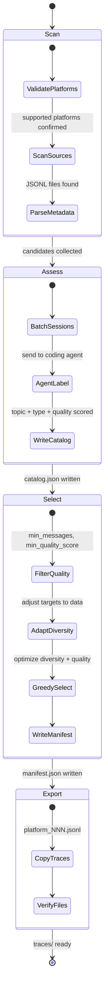

# Evaluation Framework

Last updated: 2026-03-06

## Overview

Lerim includes an evaluation framework for measuring the quality of its core pipelines:

| Pipeline | What it does | Runner |
|----------|-------------|--------|
| **Extraction** | Extracts memory candidates (decisions, learnings) from a coding session trace using DSPy | `run_extraction.py` |
| **Summarization** | Produces a structured session summary from a trace using DSPy | `run_summarization.py` |
| **Lifecycle** | Sequential syncs with periodic maintains — tests realistic memory accumulation, dedup, update, merge, archive, and consolidation | `run_lifecycle.py` |

Each eval combines two scoring layers:

1. **Deterministic checks** — schema validation, field presence, word limits (fast, free, reproducible)
2. **LLM-as-judge scoring** — a coding agent CLI (Claude Code, Codex, or OpenCode) reads the original trace and the pipeline output, then scores quality on three dimensions

Key design choice: **no new dependencies or API keys required for judging**. The judge uses coding agent CLIs that developers already have installed, leveraging existing subscriptions.

### Eval isolation

All eval runners build isolated `Config` objects in memory via `build_eval_config()`. They never read from or write to `~/.lerim/`, `<repo>/.lerim/`, or any path outside `evals/` and temp dirs. This prevents eval runs from corrupting real user data.

## Quick start

```bash
# 1. Place session trace files in evals/traces/
cp path/to/session.jsonl evals/traces/

# 2. Run any pipeline eval (--config is required)
PYTHONPATH=. python evals/run_extraction.py --config evals/configs/eval_minimax_m25.toml
PYTHONPATH=. python evals/run_summarization.py --config evals/configs/eval_minimax_m25.toml
PYTHONPATH=. python evals/run_lifecycle.py --config evals/configs/eval_minimax_m25.toml --limit 5 --maintain-every 3

# 3. Limit traces for faster runs
PYTHONPATH=. python evals/run_extraction.py --config evals/configs/eval_ollama_9b_q8.toml --limit 1

# 4. Compare results across runs
PYTHONPATH=. python evals/compare.py
PYTHONPATH=. python evals/compare.py --pipeline lifecycle
```

## Directory structure

```
evals/
  configs/                  # Model-specific eval configs (--config is required)
    eval_ollama_4b_q8_think_off.toml
    eval_ollama_4b_q8_think_on.toml
    eval_ollama_9b_q4.toml
    eval_ollama_9b_q8.toml
    eval_ollama_35b_q4.toml
    eval_minimax_m25.toml
  run_extraction.py         # Extraction pipeline eval runner
  run_summarization.py      # Summarization pipeline eval runner
  run_lifecycle.py          # Lifecycle eval runner (sequential syncs + periodic maintains)
  scores.py                 # EvalScore dataclass + deterministic checks
  judge.py                  # Coding agent CLI judge wrapper
  compare.py                # Cross-run comparison table
  judge_prompts/            # LLM judge prompt templates
    extraction.md           # Extraction quality judge prompt
    summarization.md        # Summarization quality judge prompt
    lifecycle_sync.md       # Lifecycle sync judge prompt
    lifecycle_maintain.md   # Lifecycle maintain judge prompt
    golden_extraction.md    # Golden dataset creation prompt
    golden_summarization.md # Golden dataset creation prompt
  traces/                   # Synthetic smoke-test traces (git-tracked, ships with repo)
  results/                  # Eval output JSONs (gitignored)
  scripts/                  # Standalone benchmark utilities
    bench_models.sh         # Multi-model benchmark with comparison
  dataset/                  # Dataset pipeline (real traces, gitignored output)
    build.py                # Pipeline entry point
    config.toml             # Pipeline config
    traces/                 # Real traces built by pipeline (gitignored)
```

### Trace directories

There are two trace directories — one synthetic, one real:

| Directory | Contents | Tracked in git? | Default for runners? |
|-----------|----------|-----------------|----------------------|
| `evals/traces/` | 3 synthetic smoke-test traces that ship with the repo | Yes | Yes |
| `evals/dataset/traces/` | Real session traces built by the dataset pipeline from your coding-agent sessions | No (gitignored) | No — pass `--traces-dir evals/dataset/traces/` |

Use `evals/traces/` for quick smoke tests. Use `evals/dataset/traces/` for real benchmarking.

## Configuration

Each eval run is controlled by a TOML config file. The `--config` flag is **required** — there is no default config.

The config specifies:

- Which **judge agent** scores the output (Claude Code, Codex, or OpenCode)
- Which **provider and model** runs each role (lead, explorer, extraction, summarization)
- Whether **thinking mode** is enabled (relevant for reasoning models like Qwen 3.5)
- **Timeout** in seconds for the judge and each role

### Required sections

Every eval config must contain all 5 sections:

```toml
[judge]
agent = "claude"               # "claude" | "codex" | "opencode"
timeout_seconds = 300

[lead]
provider = "ollama"
model = "qwen3.5:9b-q8_0"
thinking = false
timeout_seconds = 300

[explorer]
provider = "ollama"
model = "qwen3.5:9b-q8_0"
thinking = false
timeout_seconds = 180

[extraction]
provider = "ollama"
model = "qwen3.5:9b-q8_0"
thinking = false
timeout_seconds = 180

[summarization]
provider = "ollama"
model = "qwen3.5:9b-q8_0"
thinking = false
timeout_seconds = 180
```

For single-model benchmarks, use the same provider/model for all 4 roles.

### Creating a new config

Copy an existing config and change the model:

```bash
cp evals/configs/eval_minimax_m25.toml evals/configs/eval_my_model.toml
```

Supported providers: `ollama`, `minimax`, `openrouter`, `anthropic`, `openai`.

### Comparing models

Run the same eval with different configs, then compare:

```bash
PYTHONPATH=. python evals/run_extraction.py --config evals/configs/eval_ollama_9b_q8.toml
PYTHONPATH=. python evals/run_extraction.py --config evals/configs/eval_minimax_m25.toml
PYTHONPATH=. python evals/compare.py --pipeline extraction
```

## Eval data: session traces

Eval inputs are coding agent session traces stored in `evals/traces/`. These are JSON files that capture a complete coding session: user messages, assistant responses, tool calls, and file edits.

Currently included:

| Trace | Agent | Task | Size |
|-------|-------|------|------|
| `claude-coding-run.json` | Claude Code | Add login form validation | ~3.7KB |
| `codex-coding-run.json` | Codex | Implement rate limiting | ~3.7KB |
| `opencode-coding-run.json` | OpenCode | Add retry with backoff | ~3.7KB |

These are synthetic but realistic traces that cover common coding patterns: form validation, API rate limiting, and error retry logic. Each contains user instructions, assistant reasoning, code changes, and test results.

To add your own traces, place `.jsonl` or `.json` files in `evals/traces/`. All runners auto-discover trace files in this directory.

## Scoring

### Deterministic checks

Fast, free, reproducible checks that run before the judge.

**Extraction checks:**

| Check | What it validates |
|-------|-------------------|
| `schema_ok` | Each extracted item validates against the `MemoryCandidate` Pydantic schema |
| `has_candidates` | Pipeline produced at least one memory candidate |

**Summarization checks:**

| Check | What it validates |
|-------|-------------------|
| `fields_present` | Required frontmatter fields (`title`, `description`, `user_intent`, `session_narrative`, `coding_agent`) are all non-empty |
| `word_limits` | `user_intent` <= 150 words, `session_narrative` <= 200 words |

**Lifecycle checks:**

| Check | What it validates |
|-------|-------------------|
| `schema_ok` | Sync artifacts (extraction, summary, memory_actions) are present |
| Memory accumulation | Memory file count grows across syncs |
| Maintain actions | Memory count changes after maintain (merge/archive) |

### LLM judge scoring

The judge is a coding agent CLI invoked via subprocess. It reads the original trace, examines the pipeline output, and scores on three dimensions (each 0.0 to 1.0):

| Dimension | Weight | Description |
|-----------|--------|-------------|
| **Completeness** | 40% | Did the pipeline capture all important signals from the trace? Nothing missed? |
| **Faithfulness** | 35% | Are all outputs grounded in the trace? No hallucinated or invented content? |
| **Clarity/Coherence** | 25% | Are outputs well-written, concise, internally consistent? |

**Composite score** = completeness x 0.4 + faithfulness x 0.35 + clarity x 0.25

The third dimension is called "clarity" for extraction/summarization and "coherence" for lifecycle sync/maintain, but the weight is the same.

### How the judge works

The judge wrapper (`evals/judge.py`) supports three coding agent CLIs:

| Agent | Command |
|-------|---------|
| `claude` | `claude -p <prompt> --output-format json --allowedTools Read` |
| `codex` | `codex exec <prompt> --json --ephemeral` |
| `opencode` | `opencode run <prompt> --format json` |

For extraction/summarization evals, the prompt includes the pipeline output directly. For lifecycle evals, the judge receives file paths and uses Read/search tools to investigate strategically — avoiding loading entire files into context.

### Ship thresholds

| Pipeline | Composite threshold |
|----------|---------------------|
| Extraction | >= 0.70 |
| Summarization | >= 0.65 |
| Lifecycle (sync) | >= 0.60 |
| Lifecycle (maintain) | >= 0.60 |

## The pipeline evals in detail

### Extraction eval (`run_extraction.py`)

Tests the DSPy extraction pipeline in isolation. For each trace:

1. Runs `extract_memories_from_session_file(trace_path)` — produces a list of `MemoryCandidate` dicts
2. Validates schema (`schema_ok`) and checks candidates exist (`has_candidates`)
3. Sends the output + trace path to the judge for quality scoring

```bash
PYTHONPATH=. python evals/run_extraction.py --config evals/configs/eval_ollama_9b_q8.toml
```

### Summarization eval (`run_summarization.py`)

Tests the DSPy summarization pipeline in isolation. For each trace:

1. Runs `summarize_trace_from_session_file(trace_path)` — produces a summary dict with title, description, user_intent, session_narrative, coding_agent
2. Validates field presence and word limits
3. Sends the output + trace path to the judge

```bash
PYTHONPATH=. python evals/run_summarization.py --config evals/configs/eval_ollama_9b_q8.toml
```

### Lifecycle eval (`run_lifecycle.py`)

Tests the full system end-to-end with realistic memory accumulation. This is the most important eval — it exercises sync, extraction, summarization, dedup, update, maintain, merge, archive, and consolidation in sequence.

**Flow:**

1. Creates a shared isolated temp directory with full memory tree
2. Sorts traces chronologically (parses first-line timestamp, falls back to file mtime)
3. Sequential loop: for each trace, runs `agent.sync()` with the shared memory root
4. After every N syncs (controlled by `--maintain-every`), runs `agent.maintain()`
5. Each sync and maintain is independently judge-scored
6. Final maintain runs if there were syncs since last maintain
7. Aggregates scores and saves results

**What it tests:**

| Capability | How |
|-----------|-----|
| Extraction quality (DSPy) | Inside sync pipeline |
| Summarization quality (DSPy) | Inside sync pipeline |
| Memory write correctness | Judge checks written files |
| Dedup / no_op decisions | Later syncs see earlier memories |
| Update decisions | Similar traces trigger updates |
| Explorer candidate matching | Explorer searches growing memory |
| Merge duplicates | Maintain merges overlapping |
| Archive low-value | Maintain archives stale/trivial |
| Consolidate 3+ related | Maintain consolidates related |
| Post-maintain sync quality | Syncs after maintain see cleaned state |

**CLI flags:**

| Flag | Default | Description |
|------|---------|-------------|
| `--config` | (required) | Path to eval config TOML |
| `--traces-dir` | `evals/traces/` | Override traces directory |
| `--limit` | 20 | Max traces to process |
| `--maintain-every` | 5 | Run maintain after every N syncs |

```bash
# Quick smoke test
PYTHONPATH=. python evals/run_lifecycle.py --config evals/configs/eval_minimax_m25.toml --limit 2 --maintain-every 2

# Full benchmark
PYTHONPATH=. python evals/run_lifecycle.py --config evals/configs/eval_minimax_m25.toml --traces-dir evals/dataset/traces/ --limit 20 --maintain-every 5
```

## Result format

Results are saved as JSON in `evals/results/` (gitignored). Each file is timestamped:

```
evals/results/extraction_20260305_141043.json
evals/results/summarization_20260305_142834.json
evals/results/lifecycle_20260306_162754.json
```

### Extraction/summarization result structure

```json
{
  "timestamp": "2026-03-05T14:10:43Z",
  "pipeline": "extraction",
  "config": {"provider": "minimax", "model": "MiniMax-M2.5"},
  "judge": {"agent": "claude"},
  "performance": {
    "total_wall_time_s": 45.2,
    "avg_time_per_trace_s": 15.1,
    "trace_count": 3
  },
  "scores": {
    "schema_ok": 1.0,
    "completeness": 0.75,
    "faithfulness": 0.82,
    "clarity": 0.68,
    "composite": 0.757
  },
  "per_trace": [...]
}
```

### Lifecycle result structure

```json
{
  "timestamp": "2026-03-06T...",
  "pipeline": "lifecycle",
  "config": {
    "lead": {...}, "explorer": {...},
    "extraction": {...}, "summarization": {...}
  },
  "judge": {"agent": "claude"},
  "performance": {
    "total_wall_time_s": 1234,
    "trace_count": 20,
    "sync_count": 20,
    "maintain_count": 4,
    "maintain_every": 5,
    "avg_sync_time_s": 45.2,
    "avg_maintain_time_s": 120.3
  },
  "scores": {
    "sync_composite": 0.72,
    "maintain_composite": 0.68,
    "overall_composite": 0.71
  },
  "sync_scores": [...],
  "maintain_scores": [...]
}
```

## Comparison table

`compare.py` reads all result files, groups by pipeline, and prints a side-by-side table:

```bash
PYTHONPATH=. python evals/compare.py
PYTHONPATH=. python evals/compare.py --pipeline extraction
PYTHONPATH=. python evals/compare.py --pipeline lifecycle
```

Lifecycle comparison output:

```
Pipeline: lifecycle
Config                                  sync  maint  overall    time
----------------------------------------------------------------------
MiniMax-M2.5 (minimax)                  0.72   0.68     0.71   1234s
```

## Thinking mode and local models

For models that support thinking/reasoning mode (e.g., Qwen 3.5), the `thinking` field in the config controls whether thinking is enabled:

```toml
[extraction]
provider = "ollama"
model = "qwen3.5:4b-q8_0"
thinking = false   # Disable thinking for faster inference
```

When `thinking = false` and `provider = "ollama"`:

- **DSPy pipelines** (extraction, summarization): `reasoning_effort="none"` is passed to the LM, which DSPy/litellm translates to `think: false` on Ollama's native API
- **PydanticAI pipelines** (sync, maintain): Requests are routed through a LiteLLM proxy that translates OpenAI-format calls to Ollama's native `/api/chat` endpoint, which supports `think: false`

The LiteLLM proxy must be running on port 4000 for think-off Ollama configs to work with sync/maintain:

```bash
.venv/bin/litellm --model ollama_chat/qwen3.5:4b-q8_0 --port 4000 --api_base http://localhost:11434
```

Note: In production (`lerim serve` / `lerim up`), Lerim automatically manages
Ollama model loading and unloading via the `auto_unload` lifecycle. Evals bypass
this — they assume Ollama is running and the model is available for the duration
of the eval run.

## Multi-model benchmark script

`evals/scripts/bench_models.sh` runs extraction, summarization, and lifecycle evals across all configs (or a subset), then prints a comparison table. This is the primary way to benchmark multiple models end-to-end.

```bash
# Run all configs in evals/configs/
./evals/scripts/bench_models.sh

# Run specific configs
./evals/scripts/bench_models.sh evals/configs/eval_minimax_m25.toml evals/configs/eval_ollama_9b_q8.toml

# Customize: 3 traces, only extraction, use real dataset, clean results first
LIMIT=3 PIPELINES=extraction TRACES_DIR=evals/dataset/traces CLEAN=1 ./evals/scripts/bench_models.sh
```

| Variable | Default | Description |
|----------|---------|-------------|
| `TRACES_DIR` | auto (`evals/dataset/traces/` if exists, else `evals/traces/`) | Traces directory |
| `LIMIT` | `5` | Max traces per eval run |
| `PIPELINES` | `extraction summarization lifecycle` | Space-separated pipelines to run |
| `CLEAN` | `0` | Set to `1` to clear `evals/results/` before running |

The script auto-detects traces: if `evals/dataset/traces/` has JSONL files it uses those (real traces), otherwise falls back to `evals/traces/` (synthetic). Override with `TRACES_DIR`.

## Golden datasets

Judge prompt templates for creating gold-standard ground truth data are in `judge_prompts/`:

- `golden_extraction.md` — prompt for producing gold-standard memory extraction from a trace
- `golden_summarization.md` — prompt for producing gold-standard session summary from a trace

Use them with any coding agent to create ground-truth data:

```bash
claude -p "$(cat evals/judge_prompts/golden_extraction.md | sed 's|{trace_path}|evals/traces/session1.jsonl|')" \
  --output-format json --allowedTools Read
```

Golden datasets are the foundation for prompt optimization (DSPy MIPROv2), supervised fine-tuning, and RL training in later phases.

## Source files

| File | Purpose |
|------|---------|
| `evals/scores.py` | `EvalScore` dataclass, `compute_composite()`, deterministic check functions |
| `evals/judge.py` | `invoke_judge()` subprocess wrapper, `build_judge_prompt()` template injection, output parsing |
| `evals/run_extraction.py` | Extraction eval runner — configures DSPy, runs pipeline, scores, saves results |
| `evals/run_summarization.py` | Summarization eval runner — same flow for summarization pipeline |
| `evals/run_lifecycle.py` | Lifecycle eval runner — sequential syncs + periodic maintains with judge scoring |
| `evals/compare.py` | Loads all result JSONs, groups by pipeline, prints comparison table |

## Dataset pipeline

Build a personalized eval benchmark dataset from your real coding-agent session traces.

### Overview

The dataset pipeline scans sessions from your connected coding platforms, uses an LLM (via coding agent CLI) to assess quality and label topics, selects diverse traces optimized for benchmarking, and exports them for use with the eval runners.



### Quick start

```bash
# Build dataset using Claude as the assessment agent
PYTHONPATH=. python evals/dataset/build.py --agent claude

# Build with custom config and trace count
PYTHONPATH=. python evals/dataset/build.py --agent claude --config evals/dataset/config.toml --count 50

# Run evals against the dataset
PYTHONPATH=. python evals/run_extraction.py --config evals/configs/eval_minimax_m25.toml --traces-dir evals/dataset/traces/
PYTHONPATH=. python evals/run_lifecycle.py --config evals/configs/eval_minimax_m25.toml --traces-dir evals/dataset/traces/ --limit 10 --maintain-every 5
```

### Directory structure

```
evals/dataset/
  __init__.py               # Package init
  build.py                  # Pipeline entry point
  config.toml               # Default pipeline config
  catalog.json              # Generated: all candidates with assessments (gitignored)
  manifest.json             # Generated: selected traces metadata (gitignored)
  traces/                   # Generated: copied trace files (gitignored)
    claude_001.jsonl
    codex_001.jsonl
    opencode_001.jsonl
    cursor_001.jsonl
    ...
```

Only `build.py`, `config.toml`, and `__init__.py` are tracked in git. All generated output (`catalog.json`, `manifest.json`, `traces/`) is gitignored and private.

### Configuration

The pipeline is controlled by `evals/dataset/config.toml`:

```toml
[dataset]
trace_count = 50
agent = "claude"               # default coding agent CLI (overridable via --agent)

# Which platforms to scan — add/remove entries for your setup
[[sources]]
platform = "claude"
path = "~/.claude/projects/"

[[sources]]
platform = "codex"
path = "~/.codex/archived_sessions/"

[[sources]]
platform = "opencode"
path = "~/.lerim/cache/opencode/"

[[sources]]
platform = "cursor"
path = "~/.lerim/cache/cursor/"

[diversity]
max_platform_share = 0.6      # No single platform > 60% (ignored if 1 platform)
min_session_types = 4          # Minimum session type variety
short_pct = 0.2                # <20 messages target share
medium_pct = 0.5               # 20-80 messages target share
long_pct = 0.3                 # 80+ messages target share

[quality]
min_messages = 5               # Minimum messages per trace
min_quality_score = 3          # Minimum LLM quality score (1-5)
```

**Platform validation**: Each `[[sources]]` platform must be in the supported set (`claude`, `codex`, `opencode`, `cursor`). Unsupported platforms raise an error. Missing or empty paths are warned and skipped.

**Diversity targets**: All diversity constraints are best-effort and adapt to available data. If only 1 platform is configured, platform balancing is skipped. Session type and length targets are soft goals, not hard requirements.

### Pipeline phases

| Phase | What it does |
|-------|-------------|
| **Scan** | Discovers JSONL session files from each configured `[[sources]]` entry. Parses platform-specific metadata: message count, first user messages, project info. |
| **Assess** | Batches session snippets and sends them to the configured coding agent CLI for topic labeling, session type classification, and quality scoring (1-5). Writes `catalog.json`. |
| **Select** | Filters candidates by `min_messages` and `min_quality_score`, then uses a greedy algorithm to select diverse traces optimizing for platform balance, session type variety, length distribution, and project coverage. Writes `manifest.json`. |
| **Export** | Copies selected trace files to `evals/dataset/traces/` with standardized names (`{platform}_{NNN}.jsonl`). Files are copied as-is, no format conversion. |

### Using `--traces-dir` with eval runners

All eval runners accept `--traces-dir` to override the default trace directory:

```bash
# Run extraction eval on real dataset traces
PYTHONPATH=. python evals/run_extraction.py --config evals/configs/eval_minimax_m25.toml --traces-dir evals/dataset/traces/

# Run lifecycle eval with limit
PYTHONPATH=. python evals/run_lifecycle.py --config evals/configs/eval_minimax_m25.toml --traces-dir evals/dataset/traces/ --limit 10
```

When `--traces-dir` is not provided, runners use the default `evals/traces/` directory (the synthetic smoke-test traces).

### Manifest format

`manifest.json` describes the selected dataset:

```json
{
  "version": 1,
  "created": "2026-03-06T...",
  "description": "50 real session traces for Lerim eval benchmark",
  "agent_used": "claude",
  "trace_count": 50,
  "diversity_report": {
    "platforms": {"claude": 20, "codex": 8, "opencode": 15, "cursor": 7},
    "session_types": {"feature_implementation": 15, "debugging": 12, ...},
    "length_categories": {"short": 10, "medium": 25, "long": 15},
    "projects": ["lerim-cli", "finetune-test"]
  },
  "traces": [
    {
      "id": "claude_001",
      "file": "traces/claude_001.jsonl",
      "platform": "claude",
      "project": "lerim-cli",
      "session_type": "feature_implementation",
      "message_count": 47,
      "length_category": "medium",
      "topic": "adding memory extraction pipeline",
      "quality_score": 4,
      "source_path": "~/.claude/projects/.../session.jsonl"
    }
  ]
}
```
