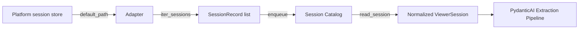

# Connecting Agents

Lerim ingests session transcripts from your coding agents to extract decisions
and learnings. The `lerim connect` command registers an agent platform so Lerim
knows where to find its sessions.

## Supported platforms

| Platform | Session store | Format | Default path |
|----------|--------------|--------|-------------|
| `claude` | JSONL files | JSONL traces | `~/.claude/projects/` |
| `codex` | JSONL files | JSONL traces | `~/.codex/sessions/` |
| `cursor` | SQLite DB | `state.vscdb`, exported to JSONL cache | `~/Library/Application Support/Cursor/User/globalStorage/` (macOS) |
| `opencode` | SQLite DB | `opencode.db`, exported to JSONL cache | `~/.local/share/opencode/` |

## Auto-detect

The fastest way to connect all supported platforms at once:

```bash
lerim connect auto
```

This scans default paths for each platform and connects any that are found.

## Connect individual platforms

```bash
lerim connect claude
lerim connect codex
lerim connect cursor
lerim connect opencode
```

## Custom session path

If your agent stores sessions in a non-default location, use `--path`:

```bash
lerim connect claude --path /custom/path/to/claude/sessions
lerim connect cursor --path ~/my-cursor-data/globalStorage
```

The path is expanded (`~` is resolved) and must exist on disk. This overrides
the auto-detected default for that platform.

## List connected platforms

```bash
lerim connect list
```

Shows each connected platform with its path, discovered session count, and whether the path exists.

## Disconnect a platform

```bash
lerim connect remove claude
lerim connect remove cursor
```

## How adapters work

Each platform adapter implements a 5-step protocol defined in
`src/lerim/adapters/base.py`:

| Step | Method | Description |
|------|--------|-------------|
| 1 | `default_path()` | Returns the default traces directory for the platform |
| 2 | `count_sessions(path)` | Returns total session count under a path |
| 3 | `iter_sessions(traces_dir, start, end, known_run_ids)` | Lists normalized session summaries in a time window |
| 4 | `find_session_path(session_id, traces_dir)` | Resolves a single session file path by ID |
| 5 | `read_session(session_path, session_id)` | Reads one session and returns a normalized `ViewerSession` payload |



!!! tip "SQLite-based platforms"
    Cursor and OpenCode use SQLite databases. Their adapters export sessions to
    a JSONL cache (`~/.lerim/cache/<platform>/`) on first read, then use the
    cache for subsequent access.

## Adding a new adapter

Want to add support for another coding agent? See `src/lerim/adapters/` for
existing examples and the [Contributing guide](../contributing/getting-started.md)
for setup instructions.
