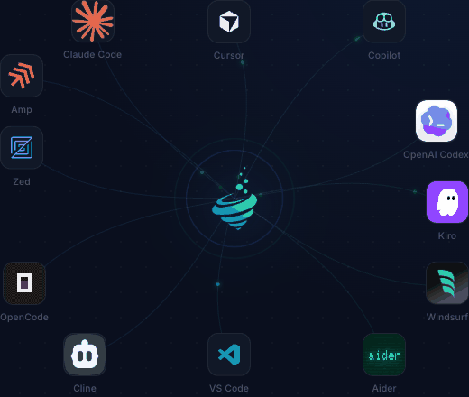

---
hide:
  - navigation
---

# Lerim

**Continual learning layer for coding agents**

<p align="center">
  
</p>

Lerim gives coding agents persistent memory across sessions. It watches your agent conversations (Claude Code, Codex, Cursor, OpenCode, ...), extracts decisions and learnings, and stores them as plain markdown files that both humans and agents can read.

Memories are refined offline over time through merging, deduplication, archiving, and decay-based forgetting.

<p align="center">
  
</p>

## How it works

1. **Connect** your coding agent platforms
2. **Sync** — Lerim reads session transcripts, extracts decisions and learnings via DSPy pipelines
3. **Maintain** — offline refinement merges duplicates, archives low-value entries, applies time-based decay
4. **Query** — ask Lerim for relevant past context at any time

## Key design principles

- **File-first** — memories are markdown files with YAML frontmatter, readable by humans and agents
- **Primitive-first** — two core types: `decisions` and `learnings`, plus episodic `summaries`
- **Project-scoped** — project memory at `<repo>/.lerim/`, global fallback at `~/.lerim/`
- **No index required** — default search scans files directly; FTS/vector/graph are optional accelerators
- **Source-available** — BSL 1.1 license, free for individual developers

## Quick install

```bash
pip install lerim
```

Then [get started](getting-started.md) in under 2 minutes.

## Links

- [PyPI](https://pypi.org/project/lerim/)
- [GitHub](https://github.com/lerim-dev/lerim-cli)
- [lerim.dev](https://lerim.dev)
