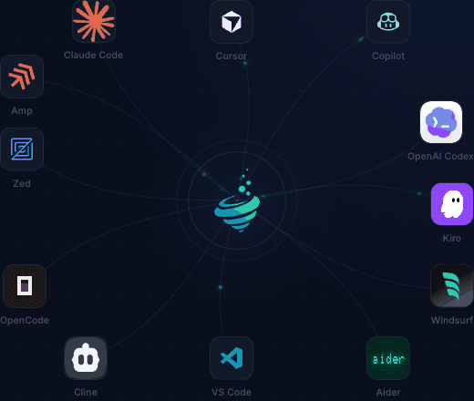
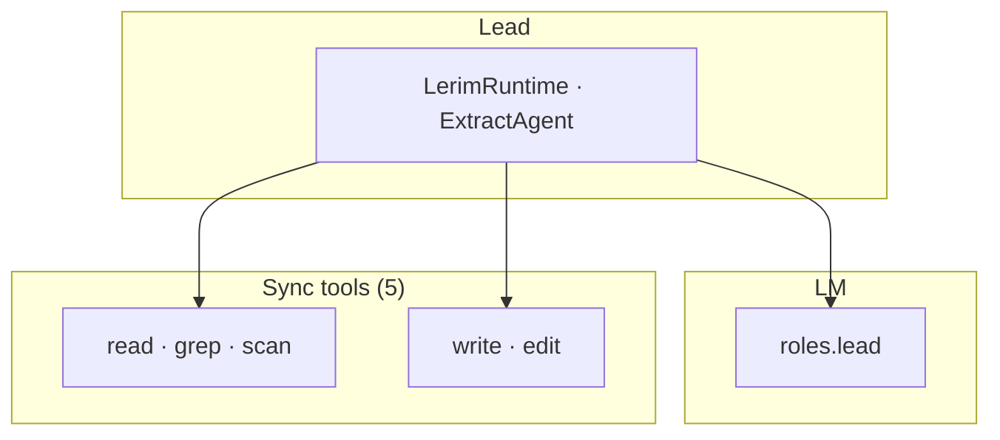
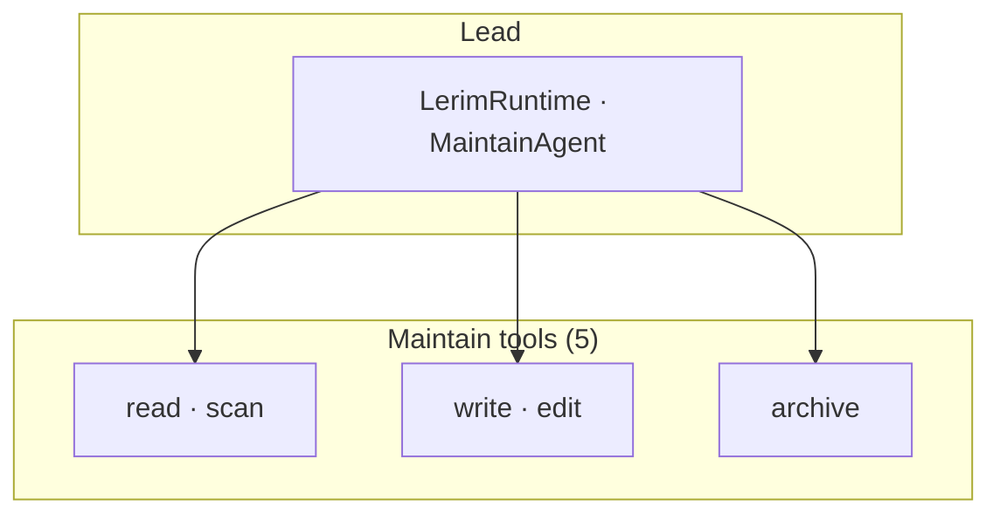

---
hide:
  - navigation
  - toc
---

<div class="hero" markdown>

# Lerim

**Your coding agents forget everything after each session. Lerim learns — across all of them.**

<p align="center">
  
</p>

Lerim is the **continual learning and context graph layer** for AI coding agents — it watches sessions, extracts structured knowledge, and builds a shared intelligence graph across agents, projects, and teams.

<p align="center">
  
</p>

</div>

---

## The problem

You spend 20 minutes explaining context to your coding agent. It writes great code. Next session? It's forgotten everything. Every decision, every pattern, every "we tried X and it didn't work" — gone.

And if you use multiple agents — Claude Code at the terminal, Cursor in the IDE, Codex for reviews — none of them know what the others learned. Your project knowledge is **scattered across isolated sessions with no shared intelligence**.

This is **agent context amnesia**, and it's the biggest productivity drain in AI-assisted development.

## The solution

Lerim solves this by:

- :material-sync: **Watching** your agent sessions across all supported coding agents
- :material-brain: **Extracting** decisions and learnings automatically using a DSPy ReAct lead agent
- :material-file-document: **Storing** everything as plain markdown files in your repo (`.lerim/`)
- :material-refresh: **Refining** knowledge over time — merges duplicates, archives stale entries, refreshes the memory index
- :material-share-variant: **Unifying** knowledge across all your agents — shared files under `.lerim/memory/`
- :material-chat-question: **Answering** questions about past context: `lerim ask "why did we choose Postgres?"`

No proprietary format. No database lock-in. Just markdown files that both humans and agents can read.

---

## Get started

<div class="grid cards" markdown>

-   :material-rocket-launch:{ .lg .middle } **Quickstart**

    ---

    Get from zero to first working command in under 5 minutes

    [:octicons-arrow-right-24: Quickstart](quickstart.md)

-   :material-download:{ .lg .middle } **Installation**

    ---

    Detailed installation instructions and prerequisites

    [:octicons-arrow-right-24: Installation](installation.md)

-   :material-console:{ .lg .middle } **CLI Reference**

    ---

    Complete command-line interface documentation

    [:octicons-arrow-right-24: CLI Reference](cli/overview.md)

-   :material-sitemap:{ .lg .middle } **How It Works**

    ---

    How Lerim works under the hood

    [:octicons-arrow-right-24: How it works](concepts/how-it-works.md)

</div>

---

## Key features

<div class="feature-grid" markdown>

<div class="feature-item" markdown>

#### :material-account-group: Multi-agent support

Works with any coding agent that produces session traces

</div>

<div class="feature-item" markdown>

#### :material-file-document-outline: Plain markdown storage

No proprietary formats — just `.md` files in `.lerim/`

</div>

<div class="feature-item" markdown>

#### :material-auto-fix: Automatic extraction

LLM pipelines extract decisions and learnings from sessions

</div>

<div class="feature-item" markdown>

#### :material-refresh: Continuous refinement

Merges duplicates, archives stale entries, maintains `index.md`

</div>

<div class="feature-item" markdown>

#### :material-chat-question-outline: Natural language queries

Ask questions about past context in plain English

</div>

<div class="feature-item" markdown>

#### :material-laptop: Local-first

Runs entirely on your machine with Docker or standalone

</div>

</div>

---

## Supported agents

| Agent | Session Format | Status |
|-------|---------------|--------|
| Claude Code | JSONL traces | :material-check-circle:{ style="color: #4caf50" } Supported |
| Codex CLI | JSONL traces | :material-check-circle:{ style="color: #4caf50" } Supported |
| Cursor | SQLite to JSONL | :material-check-circle:{ style="color: #4caf50" } Supported |
| OpenCode | SQLite to JSONL | :material-check-circle:{ style="color: #4caf50" } Supported |

!!! tip "More agents coming soon"
    PRs welcome! See the [contributing guide](contributing/getting-started.md) to add support for your favorite agent.

---

## How it works

<div class="steps" markdown>

<div class="step" markdown>

### Connect your agents

Link your coding agent platforms. Lerim auto-detects supported agents on your system.

```bash
lerim init
lerim connect auto
```

</div>

<div class="step" markdown>

### Sync sessions

Lerim reads session transcripts and runs **ExtractAgent** (DSPy ReAct) with the **`[roles.lead]`** model. The agent calls methods on `MemoryTools` to read the trace, scan existing memories, write or edit markdown, and save a session summary:


```mermaid
flowchart TB
    subgraph lead["Lead"]
        RT[LerimRuntime · ExtractAgent]
    end
    subgraph lm["LM"]
        L[roles.lead]
    end
    subgraph syncTools["Sync tools (5)"]
        t1["read · grep · scan"]
        wm["write · edit"]
    end
    RT --> L
    RT --> t1
    RT --> wm
```

</div>

<div class="step" markdown>

### Maintain knowledge

Offline refinement merges duplicates, archives low-value entries, and consolidates related learnings. **MaintainAgent** uses the same **`[roles.lead]`** model with maintain-only tools:


```mermaid
flowchart TB
    subgraph lead_m["Lead"]
        RT_m[LerimRuntime · MaintainAgent]
    end
    subgraph maintainTools["Maintain tools (5)"]
        t2["read · scan"]
        wm2["write · edit"]
        ar[archive]
    end
    RT_m --> t2
    RT_m --> wm2
    RT_m --> ar
```

</div>

<div class="step" markdown>

### Query past context

Ask Lerim about any past decision or learning. Your agents can do this too.

```bash
lerim ask "Why did we choose Postgres over MongoDB?"
lerim memory list
```

</div>

</div>

---

## Web UI (Lerim Cloud)

The browser UI lives in **[Lerim Cloud](https://lerim.dev)** (separate from this CLI package). The local daemon still exposes a **JSON API** on `http://localhost:8765` for the CLI and for Cloud when connected.

See [Web UI (Lerim Cloud)](guides/dashboard.md).

---

## Quick install

```bash
pip install lerim
```

Then follow the [quickstart guide](quickstart.md) to get running in 5 minutes.

---

## Next steps

<div class="grid cards" markdown>

-   :material-play-circle:{ .lg .middle } **Quickstart**

    ---

    Install, configure, and run your first sync in 5 minutes

    [:octicons-arrow-right-24: Get started](quickstart.md)

-   :material-connection:{ .lg .middle } **Connecting agents**

    ---

    Link your coding agent platforms for session ingestion

    [:octicons-arrow-right-24: Connect agents](guides/connecting-agents.md)

-   :material-database:{ .lg .middle } **Memory model**

    ---

    Understand how memories are stored and structured

    [:octicons-arrow-right-24: Memory model](concepts/memory-model.md)

-   :material-cog:{ .lg .middle } **Configuration**

    ---

    Customize model providers, tracing, and more

    [:octicons-arrow-right-24: Configuration](configuration/overview.md)

</div>
