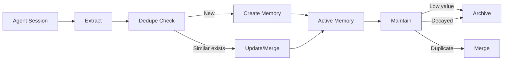

# Memory Model

Lerim stores memories as plain markdown files with YAML frontmatter. No database required — files are the canonical store.

## Primitives

Lerim uses two core memory types (primitives) plus episodic summaries:

| Primitive | Purpose | Example |
|-----------|---------|---------|
| **Decision** | An architectural or design choice made during development | "Use JWT bearer tokens for API auth" |
| **Learning** | A reusable insight, procedure, friction point, or preference | "pytest fixtures must be in conftest.py for discovery" |
| **Summary** | An episodic record of what happened in a coding session | "Refactored auth module, added rate limiting" |

### Learning kinds

Learnings are further categorized by kind:

| Kind | Description |
|------|-------------|
| `insight` | A general observation or understanding |
| `procedure` | A step-by-step process or workflow |
| `friction` | Something that caused difficulty or slowdown |
| `pitfall` | A mistake or trap to avoid |
| `preference` | A stylistic or tooling preference |

## Directory layout

### Project scope

```text
<repo>/.lerim/
  config.toml              # project overrides
  memory/
    decisions/
      <slug>.md
    learnings/
      <slug>.md
    summaries/
      YYYYMMDD/
        HHMMSS/
          <slug>.md
    archived/
      decisions/
        <slug>.md
      learnings/
        <slug>.md
  meta/
    traces/
      sessions/
        <agent>/
          <run_id>.jsonl
  workspace/
    sync-<YYYYMMDD-HHMMSS>-<shortid>/
      extract.json
      summary.json
      memory_actions.json
      agent.log
      subagents.log
      session.log
    maintain-<YYYYMMDD-HHMMSS>-<shortid>/
      maintain_actions.json
      agent.log
      subagents.log
  index/                   # reserved for FTS/vector/graph
```

### Global scope

The global fallback at `~/.lerim/` follows the same layout.

## Scope resolution

| Scope | Read behavior | Write behavior |
|-------|---------------|----------------|
| `project_fallback_global` (default) | Read from project first, fall back to global | Write to project |
| `project_only` | Project only | Project only |
| `global_only` | Global only | Global only |

## Frontmatter spec

All metadata lives in YAML frontmatter — no sidecars.

### Decision frontmatter

```yaml
---
id: dec-abc123
title: Use JWT bearer tokens for API auth
created: "2026-02-20T10:30:00Z"
updated: "2026-02-20T10:30:00Z"
source: sync
confidence: 0.85
tags:
  - auth
  - api
  - security
---

Bearer tokens with short expiry (15min) and refresh tokens...
```

**Fields:** `id`, `title`, `created`, `updated`, `source`, `confidence`, `tags`

### Learning frontmatter

```yaml
---
id: lrn-def456
title: pytest fixtures must be in conftest.py
created: "2026-02-21T14:00:00Z"
updated: "2026-02-21T14:00:00Z"
source: sync
confidence: 0.7
tags:
  - testing
  - pytest
kind: insight
---

Fixtures defined in test files are not discovered by other test files...
```

**Fields:** `id`, `title`, `created`, `updated`, `source`, `confidence`, `tags`, `kind`

### Summary frontmatter

```yaml
---
id: sum-ghi789
title: Refactored auth module
description: Added rate limiting and improved token validation
date: "2026-02-22"
time: "15:30:00"
coding_agent: claude
raw_trace_path: meta/traces/sessions/claude/abc123.jsonl
run_id: abc123
repo_name: my-project
created: "2026-02-22T15:45:00Z"
source: sync
tags:
  - auth
  - refactoring
---

## Session Summary

Refactored the authentication module...
```

**Fields:** `id`, `title`, `description`, `date`, `time`, `coding_agent`, `raw_trace_path`, `run_id`, `repo_name`, `created`, `source`, `tags`

## Memory lifecycle



1. **Create** — extraction pipeline finds candidates, deduplication check runs, new memories are written
2. **Read** — query retrieves memories with project-first scope and global fallback
3. **Update** — when similar memories exist, the lead agent merges or updates them
4. **Archive** — soft-delete to `memory/archived/`. Happens during `maintain` for low-value or decayed entries

## Confidence and decay

Each memory has a `confidence` score (0.0 to 1.0). Over time, memories that aren't accessed lose effective confidence through decay:

- **Decay period**: 180 days (configurable)
- **Floor**: confidence never drops below 0.1
- **Archive threshold**: effective confidence below 0.2 triggers archiving
- **Grace period**: memories accessed in the last 30 days skip archiving

See [Configuration](configuration.md#memory-decay) for decay settings.

## Reset policy

Memory reset is explicit and destructive:

```bash
lerim memory reset --scope both --yes     # wipe everything
lerim memory reset --scope project --yes  # project data only
```

!!! warning
    The sessions DB lives in global `index/`, so `--scope project` alone does not reset the session queue. Use `--scope global` or `--scope both` to fully reset.
